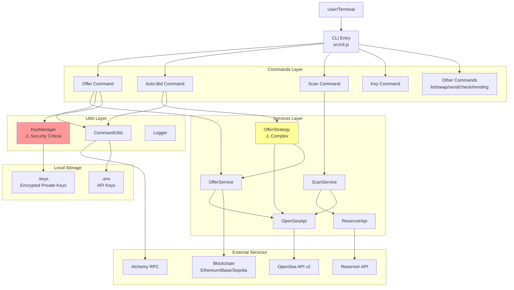
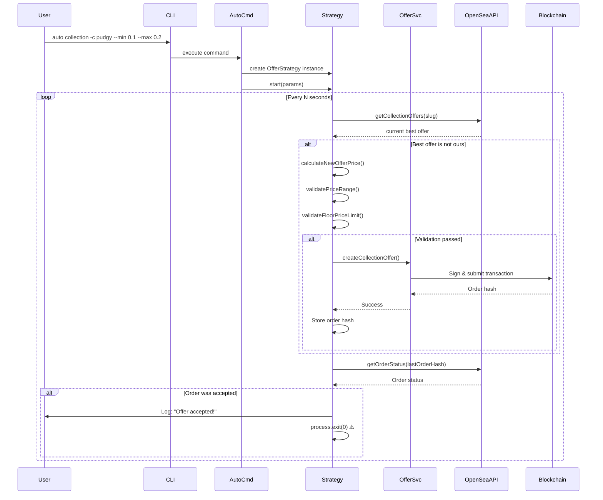
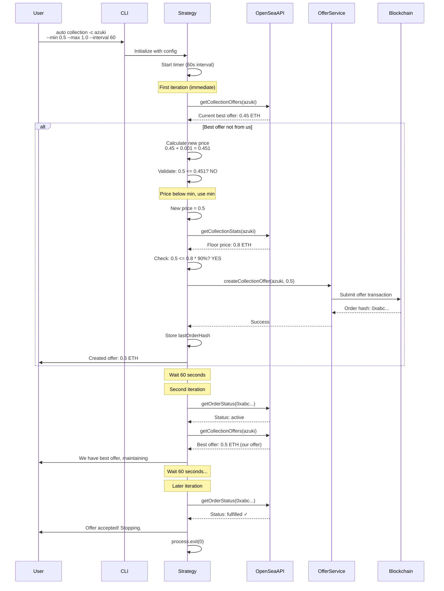
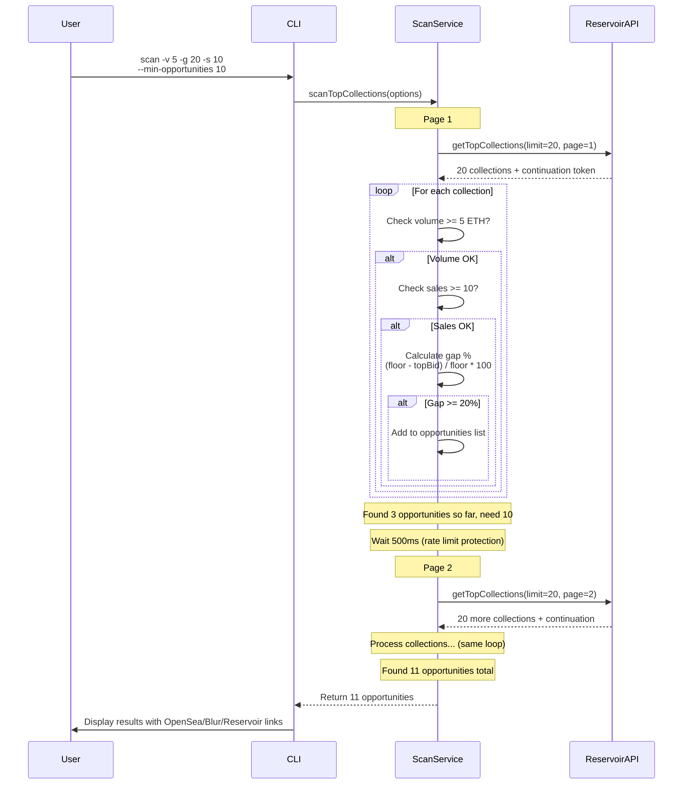

# OpenSea Offer Maker Architecture Document

## Introduction

This document outlines the overall project architecture for OpenSea Offer Maker, a Node.js CLI tool for automated NFT trading. Its primary goal is to serve as the guiding architectural reference for AI-driven development, ensuring consistency and understanding of the existing codebase patterns.

**Document Purpose**: This is a **brownfield architecture document** that records the CURRENT STATE of the system, including actual implementation patterns, technical debt, and constraints. It differs from a greenfield architecture document by focusing on reality rather than ideals.

### Starter Template or Existing Project

**Status**: Existing Project (Brownfield)

This is an established CLI tool with:
- Published to NPM as `opensea-offer-maker` v0.0.6
- ~2000+ lines of production code
- 9 CLI commands implemented
- Active development with AI tool configurations

**No starter template was used** - the project was built from scratch with manual setup.

### Change Log

| Date | Version | Description | Author |
|------|---------|-------------|--------|
| 2025-10-08 | 1.0 | Initial architecture documentation (brownfield analysis) | Winston (Architect) |

---

## High Level Architecture

### Technical Summary

OpenSea Offer Maker is a **modular CLI application** following a three-layer architecture pattern:
1. **Commands Layer** - CLI interface using Commander.js
2. **Services Layer** - Core business logic and API integration
3. **Utils Layer** - Shared utilities and helpers

The system integrates with external NFT marketplace APIs (OpenSea, Reservoir) and blockchain networks (Ethereum, Base, Sepolia) via Alchemy RPC. Private keys are stored locally with AES-256-GCM encryption. The architecture supports multi-chain operations through configuration-driven design.

**Core Design Principles** (as implemented):
- Separation of concerns (commands → services → APIs)
- Configuration over hardcoding (though some hardcoding exists as technical debt)
- Security-conscious key management
- CLI-first user experience

### High Level Overview

**Architectural Style**: Modular Monolith CLI Application

**Repository Structure**: Single repository (not a monorepo) with clear module separation

**Service Architecture**: All services run in a single Node.js process, synchronous command execution

**Primary User Flow**:
```
User → CLI Command → Command Handler → Service Layer → External API/Blockchain
                                                        ↓
User ← Display Results ← Process Response ← Response Data
```

**Key Architectural Decisions**:
1. **CLI over GUI**: Optimized for power users and automation
2. **Direct API Integration**: No backend server, direct API calls from CLI
3. **Local Key Storage**: Encrypted private keys stored locally (not remote)
4. **Synchronous Execution**: Commands run to completion, no background services (except auto-bidding timer)

### High Level Project Diagram



### Architectural and Design Patterns

- **Modular CLI Pattern**: Clear separation between CLI interface (commands) and business logic (services) - _Rationale:_ Enables testability, code reuse, and maintainability for CLI applications
- **Service Layer Pattern**: Business logic encapsulated in dedicated service classes - _Rationale:_ Promotes single responsibility, easier testing with mocked dependencies
- **Strategy Pattern**: Auto-bidding logic in OfferStrategy class - _Rationale:_ Encapsulates complex bidding algorithm, allows future strategy variations
- **Wrapper Pattern**: API clients wrap external services with retry logic - _Rationale:_ Abstracts API complexity, provides consistent error handling
- **Configuration Pattern**: Multi-chain support via configuration objects - _Rationale:_ Easily extendable to new chains without code changes

---

## Tech Stack

**Note**: This section documents the ACTUAL technology stack in use. All versions are as specified in `package.json`.

### Cloud Infrastructure

- **Provider**: N/A (CLI tool, no cloud hosting)
- **RPC Provider**: Alchemy (hardcoded dependency)
- **Deployment**: NPM Registry (public package)

### Technology Stack Table

| Category | Technology | Version | Purpose | Notes/Constraints |
|----------|------------|---------|---------|-------------------|
| **Runtime** | Node.js | 16+ (LTS) | JavaScript execution environment | ES Modules support required |
| **Package Manager** | npm | - | Dependency management | Uses package-lock.json, npm ci in CI |
| **Language** | JavaScript | ES2022 | Primary language | ES Modules (type: "module") |
| **CLI Framework** | commander.js | ^12.1.0 | Command-line interface | All 9 commands built on this |
| **Blockchain SDK** | ethers.js | ^6.13.4 | Ethereum interaction | v6 API (NOT v5) - breaking changes from v5 |
| **OpenSea SDK** | opensea-js | ^7.1.14 | NFT marketplace offers | Only used for offer creation (not queries) |
| **Reservoir SDK** | @reservoir0x/reservoir-sdk | ^2.4.32 | Cross-market listings | Requires viem wallet adapter |
| **Environment Config** | dotenv | ^16.4.5 | Load .env files | ⚠️ Validates on import, can't skip |
| **User Input** | enquirer | ^2.4.1 | Interactive prompts | Used for password input (key management) |
| **Testing Framework** | Jest | ^29.7.0 | Unit & integration testing | ⚠️ Requires --experimental-vm-modules flag |
| **Encryption** | Node.js crypto | Built-in | Private key encryption | AES-256-GCM algorithm |
| **HTTP Client** | fetch API | Built-in (Node 18+) | API calls | Native fetch, no axios/got needed |

**⚠️ Technical Debt**:
- Hardcoded Alchemy as RPC provider (no fallback)
- Hardcoded encryption salt/password in source
- Jest experimental flag required
- Some dependencies could be updated (security patches)

---

## Data Models

**Note**: As a CLI tool, there is no database. Data models represent configuration objects and in-memory structures.

### Chain Configuration

**Purpose**: Define supported blockchain networks and their parameters

**Key Attributes**:
- `name`: string - Chain identifier ('ethereum', 'base', 'sepolia')
- `chain`: Chain enum - OpenSea SDK chain constant
- `wethAddress`: address - WETH contract address for the chain

**Relationships**:
- Referenced by all commands via `--chain` parameter
- Used by CommandUtils to create appropriate provider
- Token configurations reference these chains

**Source**: `src/config.js:19-35`

### Token Configuration

**Purpose**: Define supported tokens (ETH, WETH) on each chain

**Key Attributes**:
- `symbol`: string - Token symbol ('ETH', 'WETH')
- `decimals`: number - Token decimal places (18)
- `address`: address | null - Contract address (null for native)
- `isNative`: boolean - Whether token is chain's native currency

**Relationships**:
- Grouped by chain
- Used by swap and send commands
- Referenced when calculating amounts and balances

**Source**: `src/config/tokens.js`

### Encrypted Key Storage

**Purpose**: Store multiple encrypted private keys locally

**Key Attributes**:
- `name`: string - User-friendly key name
- `encryptedKey`: hex string - AES-256-GCM encrypted private key
- `authTag`: hex string - GCM authentication tag
- `iv`: hex string - Initialization vector
- `address`: address - Ethereum address (for display)
- `isActive`: boolean - Whether this is the currently active key

**Relationships**:
- One active key per installation
- Multiple keys supported (can switch between them)
- Used by all transaction commands

**Storage**: `.keys` file (JSON format, gitignored)

**⚠️ Security Note**: Encryption uses hardcoded salt/password in source code - see technical debt section

---

## Components

### OfferService

**Responsibility**: Wrap OpenSea SDK offer creation with validation and error handling

**Key Interfaces**:
- `createCollectionOffer(params)` - Create collection-wide offer
- `createIndividualOffer(params)` - Create single NFT offer
- `validateBalance(balance, amount)` - Check WETH balance
- `getWETHBalance(contract, address)` - Query WETH balance

**Dependencies**:
- OpenSea SDK (opensea-js) for offer creation
- ethers.js for WETH contract interaction
- Logger for output

**Technology Stack**: JavaScript ES Modules, ethers.js v6, opensea-js v7

**⚠️ Known Issue**: Uses `console.log` instead of logger (inconsistent with other services)

**Source**: `src/services/offerService.js`

### OfferStrategy

**Responsibility**: Implement auto-bidding strategy with market monitoring and dynamic pricing

**Key Interfaces**:
- `start(params)` - Begin auto-bidding loop
- `stop()` - Stop auto-bidding
- `checkAndCreateOffer(params)` - Main loop iteration (check market, create offer if needed)
- `calculateNewOfferPrice(currentBest, collectionSlug)` - Price calculation with floor limits

**Dependencies**:
- OfferService for creating offers
- OpenSeaApi for market data
- Timer (setInterval) for periodic execution

**Technology Stack**: JavaScript ES Modules, setInterval for scheduling

**⚠️ Complexity Warning**:
- Most complex module in codebase
- Uses `process.exit(0)` on offer acceptance
- Error handling returns null and continues (doesn't retry failed offers)
- Can only monitor one collection/token at a time

**Source**: `src/services/offerStrategy.js`

### OpenSeaApi

**Responsibility**: Wrap OpenSea API v2 calls with retry logic and error handling

**Key Interfaces**:
- `fetchWithRetry(url, options, retries, delay)` - HTTP client with retry
- `getCollectionOffers(slug)` - Get collection offers
- `getCollectionStats(slug)` - Get stats including floor price
- `getCollectionInfo(slug)` - Get collection metadata
- `getOrderStatus(orderHash)` - Check if offer was accepted

**Dependencies**:
- Native fetch API
- Logger

**Technology Stack**: JavaScript ES Modules, native fetch

**Implementation Details**:
- 3 retries with 1 second delay (hardcoded)
- 404 returns empty array instead of error
- 401 throws immediately (no retry)

**⚠️ Code Duplication**: Similar retry logic in ReservoirApi

**Source**: `src/services/openseaApi.js`

### ReservoirApi

**Responsibility**: Wrap Reservoir API calls for cross-market data and listings

**Key Interfaces**:
- `getTopCollections(limit, options)` - Get collections by volume
- `getTrendingCollections(options)` - Get trending collections
- `getCollectionOffers(collectionId)` - Get offers (Reservoir format)

**Dependencies**:
- Native fetch API
- Logger
- Chain configuration (chooses API endpoint based on chain)

**Technology Stack**: JavaScript ES Modules, native fetch

**Chain-Specific URLs**:
- Ethereum: `https://api.reservoir.tools`
- Base: `https://api-base.reservoir.tools`
- Sepolia: `https://api-sepolia.reservoir.tools`

**⚠️ Code Duplication**: Has identical `fetchWithRetry` logic as OpenSeaApi

**Source**: `src/services/reservoirApi.js`

### ScanService

**Responsibility**: Analyze market for trading opportunities by combining multiple data sources

**Key Interfaces**:
- `scanTopCollections(options)` - Scan by volume with filters
- `scanTrendingCollections(options)` - Scan trending collections
- `_processCollections(collections, filters)` - Apply filters and calculate metrics

**Dependencies**:
- ReservoirApi for collection data
- OpenSeaApi (currently minimal use, mostly Reservoir)

**Technology Stack**: JavaScript ES Modules

**Filtering Logic**:
- Volume threshold check
- Sales estimate calculation
- Price gap percentage ((floor - topBid) / floor * 100)

**⚠️ Hardcoded**: 500ms delay between pagination pages

**Source**: `src/services/scanService.js`

### KeyManager

**Responsibility**: Encrypt, store, and manage multiple private keys securely

**Key Interfaces**:
- `static encryptKey(privateKey, name)` - Encrypt and save key
- `static decryptKey(name?)` - Decrypt key (active if name omitted)
- `static listKeys()` - List all stored keys
- `static setActiveKey(name)` - Switch active key
- `static removeKey(name)` - Delete key

**Dependencies**:
- Node.js crypto module (AES-256-GCM)
- ethers.js (validate private key format)
- File system (read/write .keys file)

**Technology Stack**: JavaScript ES Modules, Node.js crypto

**Security Model**:
- Algorithm: AES-256-GCM (authenticated encryption)
- Key derivation: scrypt(password, salt, 32)
- Storage: JSON file with per-key IV and auth tag

**⚠️ CRITICAL SECURITY ISSUE**:
```javascript
// src/utils/keyManager.js:10-12
export const SALT = Buffer.from('opensea-offer-maker-salt', 'utf8');
export const PASSWORD = 'opensea-offer-maker-password';
```
Hardcoded salt and password in source code means anyone with source can decrypt keys.

**Mitigation**: Users can set `ENCRYPTION_KEY` environment variable for custom key.

**Recommendation**: Only use for low-value wallets, not main holdings.

**Source**: `src/utils/keyManager.js`

### Component Diagrams



---

## External APIs

### OpenSea API v2

- **Purpose**: Query NFT collection data, offers, and verify order status
- **Documentation**: https://docs.opensea.io/reference/api-overview
- **Base URL**: `https://api.opensea.io`
- **Authentication**: `X-API-KEY` header (required)
- **Rate Limits**: Unknown (not documented by OpenSea for this tier)

**Key Endpoints Used**:
- `GET /api/v2/offers/collection/{slug}` - Get collection offers
- `GET /api/v2/offers/collection/{slug}/nfts/{tokenId}/best` - Get best NFT offer
- `GET /api/v2/collections/{slug}` - Get collection info
- `GET /api/v2/collections/{slug}/stats` - Get stats (floor price, volume, etc.)
- `GET /api/v2/orders/{chain}/seaport/{orderHash}` - Check order status

**Integration Notes**:
- 3 retry attempts with 1 second delay (hardcoded)
- 404 responses return empty array (not error)
- 401 responses throw immediately (API key validation)
- No rate limit handling implemented

**Used By**: `src/services/openseaApi.js`, called by OfferService, OfferStrategy, CheckCommand

### Reservoir API

- **Purpose**: Query cross-market NFT data, top collections, trending data
- **Documentation**: https://docs.reservoir.tools/
- **Base URL(s)**:
  - Ethereum: `https://api.reservoir.tools`
  - Base: `https://api-base.reservoir.tools`
  - Sepolia: `https://api-sepolia.reservoir.tools`
- **Authentication**: `x-api-key` header (optional for most endpoints, required for higher rate limits)
- **Rate Limits**: Varies by plan, generally generous for public endpoints

**Key Endpoints Used**:
- `GET /collections/v7` - Top collections by volume (with pagination)
- `GET /collections/trending/v1` - Trending collections by time period
- `GET /orders/bids/v6` - Collection offers
- `POST /execute/list/v5` (via SDK) - Create cross-market listings

**Integration Notes**:
- API URL automatically selected based on chain
- 3 retry attempts with 1 second delay (hardcoded)
- Supports pagination with continuation tokens
- SDK used for listing creation (requires viem wallet adapter)

**Used By**: `src/services/reservoirApi.js`, called by ScanService, ListCommand

### Alchemy RPC

- **Purpose**: Ethereum node access for blockchain operations
- **Documentation**: https://docs.alchemy.com/
- **Base URL**: Varies by chain and API key
- **Authentication**: API key in URL or provider configuration
- **Rate Limits**: Varies by plan (free tier: 300 req/sec)

**Key Operations Used**:
- Read WETH balance (`balanceOf`)
- Estimate gas for transactions
- Send signed transactions
- Query transaction status

**Integration Notes**:
- ⚠️ **Hardcoded** - No fallback to other RPC providers
- Created via `ethers.AlchemyProvider` in `commandUtils.js:44-47`
- Chain name mapping: 'ethereum' → 'mainnet', 'base' → 'base', 'sepolia' → 'sepolia'

**Used By**: All transaction commands via `getWallet()` in CommandUtils

---

## Core Workflows

### Auto-Bidding Workflow



### Market Scanning Workflow



---

## REST API Spec

**N/A** - This is a CLI application, not a REST API server. The tool consumes external REST APIs but does not expose any HTTP endpoints.

---

## Database Schema

**N/A** - No database. All state is either:
- Configuration files (`.env`, `.keys`)
- In-memory during command execution
- External (on blockchain or in external APIs)

---

## Source Tree

```
opensea-offer-maker/
├── .bmad-core/                     # BMAD framework configs (AI dev tool)
│   ├── agents/                     # AI agent definitions
│   ├── checklists/                 # Quality checklists
│   ├── data/                       # Project data/preferences
│   ├── tasks/                      # Reusable task definitions
│   ├── templates/                  # Document templates
│   └── utils/                      # Framework utilities
├── .claude/                        # Claude Code configurations
├── .gemini/                        # Gemini configurations
├── .windsurf/                      # Windsurf configurations
├── .github/
│   └── workflows/
│       └── publish.yml             # NPM publish workflow (⚠️ int tests disabled)
├── coverage/                       # Jest coverage reports (gitignored)
├── docs/
│   ├── prd.md                      # Product Requirements Doc (Chinese)
│   └── architecture.md             # This document
├── node_modules/                   # NPM dependencies (gitignored)
├── src/
│   ├── __tests__/                  # Test files (⚠️ ~60% coverage)
│   │   ├── openseaApi.test.js              # Unit tests (mocked)
│   │   ├── openseaApi.integration.test.js  # Integration tests (real API)
│   │   └── offerService.integration.test.js
│   ├── commands/                   # CLI commands (9 total)
│   │   ├── autoOfferCommand.js             # Auto-bidding (2 subcommands)
│   │   ├── checkOffersCommand.js           # Query offers/stats
│   │   ├── keyCommand.js                   # Key management (6 subcommands)
│   │   ├── listCommand.js                  # Cross-market listing
│   │   ├── offerCommand.js                 # Single offer creation
│   │   ├── scanCommand.js                  # Market scanning
│   │   ├── sendCommand.js                  # Token transfers
│   │   ├── swapCommand.js                  # ETH/WETH swaps
│   │   ├── trendingCommand.js              # Trending collections
│   │   └── index.js                        # Export all commands
│   ├── config/
│   │   └── tokens.js               # Token configs (multi-chain addresses)
│   ├── services/                   # Business logic layer
│   │   ├── offerService.js                 # Offer creation wrapper
│   │   ├── offerStrategy.js                # ⚠️ Auto-bidding (complex)
│   │   ├── openseaApi.js                   # OpenSea API wrapper
│   │   ├── reservoirApi.js                 # Reservoir API wrapper
│   │   └── scanService.js                  # Market scanning logic
│   ├── utils/                      # Utility functions
│   │   ├── commandUtils.js                 # Chain validation, wallet creation
│   │   ├── env.js                          # Environment variable exports
│   │   ├── keyManager.js                   # ⚠️ Key encryption (security critical)
│   │   └── logger.js                       # Logging utility
│   ├── cli.js                      # CLI entry point (Commander setup)
│   └── config.js                   # Main config (chains, env validation)
├── .env                            # ⚠️ Environment variables (user creates, gitignored)
├── .keys                           # ⚠️ Encrypted keys storage (auto-generated, gitignored)
├── .gitignore                      # Git ignore rules
├── .npmignore                      # NPM publish ignore (⚠️ excludes tests)
├── babel.config.js                 # Babel config for Jest
├── jest.config.js                  # Jest configuration
├── package.json                    # NPM package definition
├── package-lock.json               # Locked dependency versions
└── README.md                       # User documentation
```

**Key Directory Notes**:
- `src/commands/`: Each file = one CLI command (follows Commander.js pattern)
- `src/services/`: Business logic isolated from CLI concerns
- `src/utils/`: Shared utilities used across commands/services
- `.bmad-core/` etc: AI development tool configurations (not runtime)

**⚠️ Critical Files**:
- `.env` - MUST be created manually by user
- `.keys` - Auto-generated, contains encrypted private keys
- `src/utils/keyManager.js` - Security critical, modify carefully
- `src/services/offerStrategy.js` - Most complex logic

---

## Infrastructure and Deployment

### Infrastructure as Code

- **Tool**: N/A (no cloud infrastructure)
- **Location**: N/A
- **Approach**: CLI tool distributed via NPM, no infrastructure provisioning

### Deployment Strategy

- **Strategy**: NPM package publishing (manual + automated)
- **CI/CD Platform**: GitHub Actions
- **Pipeline Configuration**: `.github/workflows/publish.yml`

**Automated Workflow**:
1. Developer pushes git tag matching `v*` (e.g., `v0.0.7`)
2. GitHub Actions workflow triggers
3. Steps:
   - Checkout code
   - Setup Node.js 20.x
   - Run `npm ci` (clean install from lockfile)
   - Run `npm test` (unit tests only)
   - ⚠️ Skip integration tests (`if: false` in workflow)
   - Run `npm publish --access public`
4. Package available on NPM registry within minutes

**Manual Workflow**:
```bash
npm version patch  # or minor, major
git push --tags
npm publish --access public
```

### Environments

- **Development**: Local developer machine
  - Local `node src/cli.js` execution
  - Can use test networks (Sepolia)
  - Separate API keys recommended

- **Production**: User's machine (via NPM install)
  - Installed globally: `npm install -g opensea-offer-maker`
  - Runs with user's API keys and private keys
  - Real blockchain networks (Ethereum, Base)

**Note**: No staging environment - published package goes directly to users

### Environment Promotion Flow

```
Developer Machine → Git Push → GitHub Actions → NPM Registry → User Installation
                       ↓
                    Tag created (v*)
                       ↓
                  Tests pass (unit only)
                       ↓
                  Publish to NPM
```

### Rollback Strategy

- **Primary Method**: NPM version rollback + documentation
  - If critical bug found, publish patched version immediately
  - Unpublish broken version from NPM (if within 72 hours)
  - Update README with warning about broken version

- **Trigger Conditions**:
  - Critical security vulnerability discovered
  - Data loss bug affecting user funds
  - Complete CLI failure preventing usage

- **Recovery Time Objective**: 2-4 hours
  - Time to identify issue
  - Time to develop/test patch
  - Time to publish new version
  - Users must manually update

**⚠️ Limitation**: No automatic rollback, users must update manually

---

## Error Handling Strategy

### General Approach

- **Error Model**: JavaScript Error objects with custom messages
- **Exception Hierarchy**: No formal hierarchy, uses error messages and codes
- **Error Propagation**: Inconsistent (see technical debt)
  - Commands: Often catch and `process.exit(1)`
  - Services: Mix of throw, return null, and log-only
  - Strategy: Returns null on error, continues running

### Logging Standards

- **Library**: Custom logger (`src/utils/logger.js`) - simple console wrapper
- **Format**: Colored console output, no structured logging
- **Levels**:
  - `INFO`: Normal operation messages (green)
  - `DEBUG`: Detailed debugging info (gray) - enabled with `--debug` flag
  - `ERROR`: Error messages (red)

**Required Context**:
- Correlation ID: None (not implemented)
- Service Context: Implicit (module name in log message)
- User Context: Wallet address included when relevant

**⚠️ Logging Inconsistency**: Some modules use `console.log` directly instead of logger

### Error Handling Patterns

#### External API Errors

- **Retry Policy**: 3 attempts with 1 second delay (hardcoded in fetchWithRetry)
- **Circuit Breaker**: Not implemented
- **Timeout Configuration**: No explicit timeouts (uses fetch defaults)
- **Error Translation**:
  - 404 → Return empty array (not error)
  - 401 → Throw "Invalid API key" (no retry)
  - Other errors → Throw with HTTP status and details

**Example** (`src/services/openseaApi.js:10-54`):
```javascript
async fetchWithRetry(url, options, retries = 3, delay = 1000) {
  for (let i = 0; i < retries; i++) {
    try {
      const response = await fetch(url, ...);
      if (response.status === 404) return { offers: [] };
      if (response.status === 401) throw new Error('Invalid API key');
      if (!response.ok) throw new Error(`HTTP error! status: ${response.status}`);
      return await response.json();
    } catch (error) {
      if (i === retries - 1) throw error;
      await new Promise(resolve => setTimeout(resolve, delay));
    }
  }
}
```

#### Business Logic Errors

- **Custom Exceptions**: No custom exception classes
- **User-Facing Errors**: Direct error messages via logger.error()
- **Error Codes**: Not implemented (uses error messages)

**Example** (`src/services/offerService.js:112-120`):
```javascript
try {
  // Business logic
} catch (error) {
  logger.error('Failed to create collection offer:', error);
  throw error;  // Propagate to command layer
}
```

#### Data Consistency

- **Transaction Strategy**: Blockchain transactions are atomic (built-in)
- **Compensation Logic**: Not implemented (offers can't be cancelled easily)
- **Idempotency**: Not enforced (duplicate offers possible if retry)

**⚠️ Auto-Bidding Edge Case**: If offer is accepted during retry, tool may create duplicate offer

---

## Coding Standards

### Core Standards

- **Languages & Runtimes**: JavaScript ES2022, Node.js 16+ (ES Modules)
- **Style & Linting**: No formal linter configured (should add ESLint)
- **Test Organization**:
  - Unit tests: `src/__tests__/*.test.js` (mock external dependencies)
  - Integration tests: `src/__tests__/*.integration.test.js` (real APIs)
  - Test framework: Jest with experimental ES Modules support

### Naming Conventions

| Element | Convention | Example |
|---------|-----------|---------|
| Files | camelCase | `offerService.js`, `keyManager.js` |
| Classes | PascalCase | `class OfferService`, `class KeyManager` |
| Functions | camelCase | `createOffer()`, `getWallet()` |
| Constants | UPPER_SNAKE_CASE | `DEFAULT_CHAIN`, `SUPPORTED_CHAINS` |
| Private methods | _prefixed | `_processCollections()` (not strictly enforced) |

### Critical Rules

- **Logging**: Use `logger.info/debug/error()` from `src/utils/logger.js` - NEVER use `console.log` directly
  - ⚠️ Current violation: `offerService.js` uses console.log

- **Error Handling**: Commands must catch errors and call `logger.error()` before exiting
  - Don't let raw stack traces reach users
  - Provide helpful error messages

- **Environment Variables**: Access via `src/config.js` or `src/utils/env.js` - don't use `process.env` directly
  - Centralized access enables validation

- **Private Keys**: NEVER log private keys, even in debug mode
  - Only log addresses or partial keys (first 6 + last 4 chars)

- **API Keys**: Load from environment only, never hardcode

- **Chain Configuration**: Use `SUPPORTED_CHAINS` from `src/config.js` - don't hardcode chain parameters

- **BigInt Arithmetic**: When working with Wei amounts, use BigInt carefully
  - Always convert to BigInt before arithmetic
  - Format for display correctly (ethers.formatUnits)

---

## Test Strategy and Standards

### Testing Philosophy

- **Approach**: Test-after (tests written post-implementation) - NOT TDD
- **Coverage Goals**: 80% target (currently ~60%)
- **Test Pyramid**: Mostly unit tests, some integration tests, no E2E tests

**Current Reality**:
- ⚠️ Integration tests disabled in CI
- ⚠️ Key modules untested (OfferStrategy, KeyManager)
- ⚠️ No E2E command tests

### Test Types and Organization

#### Unit Tests

- **Framework**: Jest ^29.7.0
- **File Convention**: `*.test.js` in `src/__tests__/` directory
- **Location**: `src/__tests__/`
- **Mocking Library**: Jest built-in mocks
- **Coverage Requirement**: 80% (aspirational)

**AI Agent Requirements**:
- Generate tests for all public methods
- Cover edge cases and error conditions
- Follow AAA pattern (Arrange, Act, Assert)
- Mock all external dependencies (fetch, ethers.js)

**Example Test Structure**:
```javascript
describe('OpenSeaApi', () => {
  let api;
  let mockFetch;

  beforeEach(() => {
    global.fetch = mockFetch = jest.fn();
    api = new OpenSeaApi('test-api-key', 'https://api.test');
  });

  describe('fetchWithRetry', () => {
    it('should retry on failure', async () => {
      mockFetch
        .mockRejectedValueOnce(new Error('Network error'))
        .mockResolvedValueOnce({ ok: true, json: () => Promise.resolve({ data: 'test' }) });

      const result = await api.fetchWithRetry('test-url', {}, 3, 10);

      expect(result).toEqual({ data: 'test' });
      expect(mockFetch).toHaveBeenCalledTimes(2);
    });
  });
});
```

#### Integration Tests

- **Scope**: Real API calls to test actual integration behavior
- **Location**: `src/__tests__/*.integration.test.js`
- **Test Infrastructure**:
  - **OpenSea API**: Real API key required (from environment)
  - **Alchemy RPC**: Real API key required
  - **Blockchain**: Read-only calls to test networks

**Current Status**: ⚠️ Disabled in CI (`if: false` in publish.yml)

**Run Manually**:
```bash
npm run integration
npm run test:opensea
npm run test:opensea:debug
```

#### End-to-End Tests

- **Status**: ⚠️ NOT IMPLEMENTED
- **Need**: Command-level tests executing full CLI flows
- **Challenge**: Requires real API keys and possibly blockchain transactions

### Test Data Management

- **Strategy**: Mocked data for unit tests, real APIs for integration tests
- **Fixtures**: None currently (should add for common API responses)
- **Factories**: Not used
- **Cleanup**: Not needed (no database, no persistent state)

### Continuous Testing

- **CI Integration**: GitHub Actions runs unit tests only
  - On tag push: `npm test` before publish
  - On PR: No CI configured

- **Performance Tests**: Not implemented
- **Security Tests**: Not implemented (should add dependency scanning)

**⚠️ Major Gap**: Integration tests not running in CI

---

## Security

### Input Validation

- **Validation Library**: None (manual validation)
- **Validation Location**: Command layer (argument parsing) and service layer
- **Required Rules**:
  - Chain names validated against `SUPPORTED_CHAINS`
  - Private keys validated via ethers.js (will throw if invalid)
  - Addresses validated via ethers.js `isAddress()`
  - Amounts validated to be positive numbers

**⚠️ Limited Validation**: No input sanitization for display, no SQL injection risk (no database)

### Authentication & Authorization

- **Auth Method**: Local private key (no remote authentication)
- **Session Management**: N/A (CLI tool, no sessions)
- **Required Patterns**:
  - User must add private key via `key add` command before transacting
  - Active key automatically selected, or specify with `--private-key` flag
  - No remote authentication - tool acts as user's wallet

### Secrets Management

- **Development**: `.env` file (must be created manually, gitignored)
- **Production**: Same (user's `.env` file on their machine)
- **Code Requirements**:
  - ⚠️ **VIOLATION**: Encryption salt/password hardcoded in `src/utils/keyManager.js`
  - API keys loaded from environment only
  - Private keys encrypted before storage
  - No secrets in logs (but addresses are logged)

**⚠️ CRITICAL SECURITY ISSUE**:
```javascript
// src/utils/keyManager.js:10-12
export const SALT = Buffer.from('opensea-offer-maker-salt', 'utf8');
export const PASSWORD = 'opensea-offer-maker-password';
```
Anyone with source code can decrypt stored private keys.

**Mitigation Available**: Set `ENCRYPTION_KEY` environment variable

**Recommendation**:
1. Prompt user for password on first use
2. Use system keychain for key storage
3. Or clearly document: "Only use for low-value wallets"

### API Security

- **Rate Limiting**: Not implemented (relies on API provider limits)
- **CORS Policy**: N/A (not a web server)
- **Security Headers**: N/A (not a web server)
- **HTTPS Enforcement**: HTTPS used for all external APIs (native to fetch)

### Data Protection

- **Encryption at Rest**: Private keys encrypted with AES-256-GCM
- **Encryption in Transit**: HTTPS for all API calls
- **PII Handling**: Wallet addresses logged (considered public info in crypto)
- **Logging Restrictions**:
  - Never log private keys
  - Only log addresses (public info)
  - API keys not logged

### Dependency Security

- **Scanning Tool**: None configured (should add npm audit or Snyk)
- **Update Policy**: Manual updates (no automated dependency updates)
- **Approval Process**: No formal process (open source, accept community contributions)

**⚠️ Gap**: No automated dependency vulnerability scanning in CI

### Security Testing

- **SAST Tool**: None (should add ESLint with security plugins)
- **DAST Tool**: N/A (not a web application)
- **Penetration Testing**: None (open source tool, community reviewed)

**Recommendations**:
1. Add `npm audit` to CI pipeline
2. Add ESLint with security rules
3. Add dependency update automation (Dependabot)
4. Fix hardcoded encryption keys issue

---

## Technical Debt Summary

This section consolidates all technical debt mentioned throughout the document for AI agent awareness.

### Priority 1 - Security (Critical)

1. **Hardcoded Encryption Keys** (`src/utils/keyManager.js:10-12`)
   - Salt and password visible in source
   - Anyone with source can decrypt stored keys
   - Fix: Prompt user for password or use system keychain

2. **No Dependency Scanning**
   - Vulnerable dependencies may go undetected
   - Fix: Add npm audit to CI pipeline

### Priority 2 - Testing (High)

3. **Low Test Coverage** (~60% actual, 80% target)
   - OfferStrategy completely untested
   - KeyManager security functions untested
   - Fix: Write tests for critical paths first

4. **Integration Tests Disabled in CI** (`.github/workflows/publish.yml:28`)
   - Tests exist but `if: false` in workflow
   - Regressions could reach production
   - Fix: Enable with test API keys in GitHub secrets

5. **No E2E Tests**
   - Command-level flows not tested end-to-end
   - Fix: Add E2E test framework

### Priority 3 - Code Quality (Medium)

6. **Code Duplication - fetchWithRetry**
   - Identical logic in `openseaApi.js` and `reservoirApi.js`
   - Fix: Extract to `src/utils/apiUtils.js`

7. **Logging Inconsistency**
   - Most modules use logger, but `offerService.js` uses console.log
   - Fix: Replace all console.log with logger

8. **Error Handling Inconsistency**
   - Three different patterns: throw, return null, process.exit
   - Fix: Document and standardize error handling strategy

9. **Hardcoded Configuration**
   - Retry counts, delays, gas buffers, RPC provider
   - Fix: Move to configuration file or environment variables

### Priority 4 - Functionality (Low)

10. **Auto-Bidding Limitations**
    - Can only monitor one collection at a time
    - No pause/resume functionality
    - Uses process.exit() for shutdown
    - Fix: Redesign with better state management

11. **No RPC Failover**
    - Hardcoded Alchemy provider
    - No fallback if Alchemy down
    - Fix: Add fallback RPC providers

12. **No Linter Configuration**
    - No ESLint or Prettier configured
    - Code style not enforced
    - Fix: Add ESLint with recommended rules

---

## Checklist Results Report

*(Checklist execution would go here if running the architect checklist)*

---

## Next Steps

### For AI Development Agents

When working on this codebase:

1. **Read This Document First** - Understand current architecture before making changes

2. **Check Technical Debt** - Review if your work touches any debt areas

3. **Follow Patterns**:
   - Commands → Services → APIs (maintain layer separation)
   - Use logger (not console.log)
   - Add tests for new code (aim for 80% coverage)
   - Use configuration, avoid hardcoding

4. **Critical Files** - Modify with extreme care:
   - `src/utils/keyManager.js` - Security critical
   - `src/services/offerStrategy.js` - Complex logic
   - `src/config.js` - Used everywhere
   - `.keys` file format - Breaking change for users

5. **Safe to Modify**:
   - Individual command files (maintain CLI interface)
   - API wrappers (add retry logic, improve error handling)
   - Logger (add file output, improve formatting)
   - Tests (please add more!)

6. **Before Committing**:
   - Run tests: `npm test`
   - Check coverage: `npm run test:coverage`
   - Manually test affected commands
   - Update this document if architecture changes

### For Product Owner / Story Manager

Reference documents for story creation:
- **PRD**: `docs/prd.md` (Chinese) - Feature requirements
- **This Doc**: `docs/architecture.md` - Technical implementation details

Stories should reference specific components from this document and consider technical debt items.

### For DevOps / Infrastructure

Infrastructure setup:
- **CI/CD**: `.github/workflows/publish.yml` - Fix integration test disabling
- **Security**: Add npm audit scanning
- **Monitoring**: No monitoring currently (CLI tool)

---

**Document Version**: 1.0
**Last Updated**: 2025-10-08
**Status**: Current (reflects v0.0.6 codebase)
**Next Review**: When significant refactoring or new features are added
