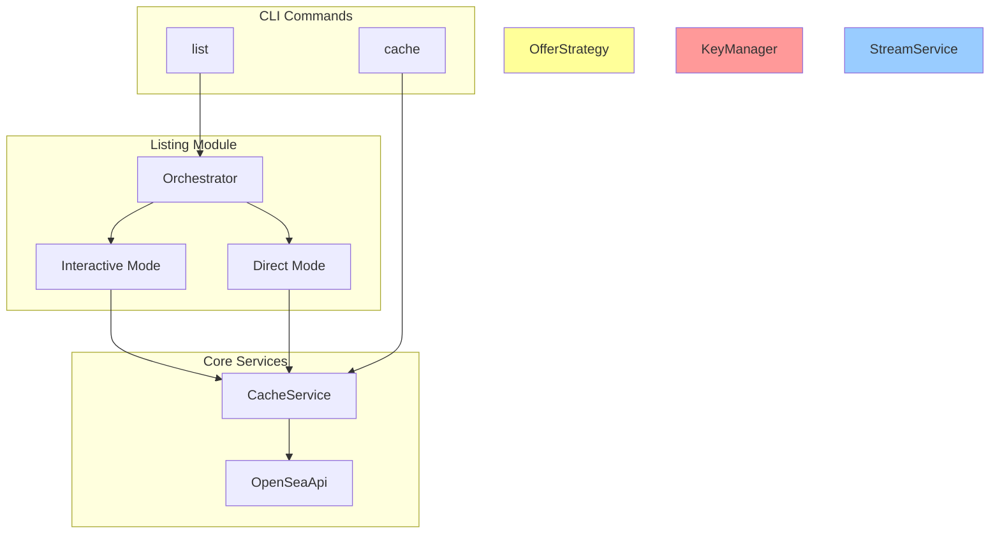

# 组件架构详解

## 核心服务组件

### OfferService - 出价服务

**职责**：封装 OpenSea SDK，提供出价创建的核心业务逻辑

**文件位置**：`src/services/offerService.js` (5.1KB)

**关键接口**：
- `createCollectionOffer(params)` - 创建集合级出价
- `createIndividualOffer(params)` - 创建单个 NFT 出价
- `validateBalance(balance, amount)` - 验证 WETH 余额
- `getWETHBalance(contract, address)` - 查询 WETH 余额
- `validateCollectionOffer(collectionSlug)` - 验证集合出价参数
- `validateIndividualOffer(tokenAddress, tokenId)` - 验证单品出价参数

**依赖项**：
- OpenSea SDK (opensea-js v8.0.3) - 核心出价功能
- ethers.js v6.15.0 - WETH 合约交互
- Logger - 统一日志输出

**设计特点**：
- 完整的参数验证和错误处理
- 支持特征出价（trait-based offers）
- 自动计算过期时间戳
- 余额检查前置验证

---

### OfferStrategy - 策略引擎

**职责**：实现自动竞价策略，市场监控和动态定价

**文件位置**：`src/services/offerStrategy.js` (13.0KB)

**关键接口**：
- `start(params)` - 启动自动竞价循环
- `stop()` - 停止自动竞价
- `checkAndCreateOffer(params)` - 核心策略逻辑
- `calculateNewOfferPrice(currentBest, collectionSlug)` - 价格计算算法
- `validatePriceRange(price)` - 价格范围验证
- `validateFloorPriceLimit(price, collectionSlug)` - 地板价限制验证
- `checkLastOffer()` - 检查上次出价状态

**策略算法**：
1. 定期获取当前最高出价
2. 如果不是自己的出价，计算新价格 = 当前最高 + 增量
3. 验证新价格在用户设定范围内
4. 验证不超过地板价百分比限制
5. 创建新出价并记录状态

**复杂度警告**：
- 代码库中最复杂的业务逻辑模块
- 涉及市场时机判断和价格策略
- 需要处理竞态条件和异常情况

---

### OpenSeaApi - API 集成层

**职责**：OpenSea API v2 完整封装，包含重试、代理支持和错误处理

**文件位置**：`src/services/openseaApi.js` (33.1KB - 最大服务文件)

**关键接口**：
- `fetchWithRetry(url, options, retries, delay)` - 带重试的 HTTP 客户端
- `getCollectionOffers(slug)` - 获取集合出价列表
- `getCollectionStats(slug)` - 获取集合统计数据（地板价、交易量等）
- `getNFTOffers(contractAddress, tokenId)` - 获取单个 NFT 出价
- `getBestNFTOffer(collectionSlug, tokenId)` - 获取最佳 NFT 出价
- `getCollectionInfo(collectionSlug)` - 获取集合基本信息
- `getBestListings(collectionSlug, limit)` - 获取最佳挂单
- `getOrderStatus(orderHash)` - 查询订单状态

**技术特性**：
- 3次重试机制，指数退避策略
- HTTP 代理支持（国际用户）
- 60秒超时配置
- 完整的错误分类处理
- 429 状态码智能处理

**代理配置**：
- 支持 HTTPS 代理
- 自动检测 `HTTP_PROXY` 环境变量
- 代理连接失败时的优雅降级

---

### StreamService - 实时流处理

**职责**：OpenSea Stream API 集成，实时事件监控和处理

**文件位置**：`src/services/streamService.js` (12.6KB)

**关键接口**：
- `startMonitoring(params)` - 开始实时监控
- `stopMonitoring()` - 停止监控
- `handleEvent(event)` - 事件处理核心逻辑
- `saveEvent(event)` - 事件持久化存储
- `reconnectWebSocket()` - WebSocket 重连机制

**支持的事件类型**：
- `sale` - 销售事件
- `transfer` - 转账事件
- `listing` - 挂单事件
- `bid` - 出价事件
- `cancel` - 取消事件

**技术特性**：
- WebSocket 持久连接
- 自动重连机制（指数退避）
- 事件去重和过滤
- JSONL 格式事件存储
- 连接状态监控

**存储机制**：
- 文件路径：`.cache/events/{wallet}_{chain}.jsonl`
- 按时间和钱包分组存储
- 自动清理过期事件

---

### CacheService - 缓存系统

**职责**：文件系统缓存管理，NFT 元数据和查询结果缓存

**文件位置**：`src/services/cacheService.js` (14.2KB)

**关键接口**：
- `getNFTMetadata(contractAddress, tokenId)` - 获取 NFT 元数据
- `setNFTMetadata(contractAddress, tokenId, metadata)` - 缓存 NFT 元数据
- `getCachedCollectionStats(slug)` - 获取缓存的集合统计
- `setCachedCollectionStats(slug, stats, ttl)` - 缓存集合统计
- `clearCache()` - 清理所有缓存
- `getCacheSize()` - 获取缓存大小
- `loadCache(wallet, chain)` - 加载指定钱包和链的NFT缓存，供交互式挂单使用。

**缓存策略**：
- TTL（生存时间）支持
- LRU（最近最少使用）清理
- 按数据类型分层存储
- 缓存命中率统计

**存储结构**：
```
.cache/
├── nfts/
│   └── {contractAddress}_{tokenId}.json
├── collections/
│   └── {collectionSlug}.json
└── metadata/
    └── cache_stats.json
```

---

### NotificationService - 通知系统

**职责**：事件通知处理，用户界面反馈和状态更新

**文件位置**：`src/services/notificationService.js` (23.9KB)

**关键接口**：
- `sendNotification(type, data)` - 发送通知
- `formatEventMessage(event)` - 格式化事件消息
- `handleRealTimeEvent(event)` - 实时事件处理
- `updateMonitorStatus(status)` - 更新监控状态
- `generateSummaryReport()` - 生成汇总报告

**通知类型**：
- 实时事件通知
- 交易状态更新
- 错误和警告消息
- 监控状态变更
- 系统健康检查

**格式化功能**：
- 多语言支持（中英文）
- 彩色控制台输出
- 详细/简洁模式切换
- 自定义消息模板

---

### PollingMonitorService - 轮询监控

**职责**：基于轮询的市场监控，WebSocket 的备用监控方案

**文件位置**：`src/services/pollingMonitorService.js` (25.9KB)

**关键接口**：
- `startPolling(params)` - 开始轮询监控
- `stopPolling()` - 停止轮询
- `pollCollectionStats(slug)` - 轮询集合统计
- `pollWalletActivity(address)` - 轮询钱包活动
- `checkForChanges(currentData, previousData)` - 变化检测

**轮询策略**：
- 可配置轮询间隔（默认 60 秒）
- 智能间隔调整（基于市场活跃度）
- 数据变化检测和通知
- API 调用频率限制

**适用场景**：
- WebSocket 连接不稳定
- 需要历史数据对比
- 特定时间段的监控
- 低频数据更新需求

---

### BuyService - 购买服务

**职责**：NFT 购买功能，支持即时购买和策略购买

**文件位置**：`src/services/buyService.js` (10.7KB)

**关键接口**：
- `buyNow(params)` - 即时购买
- `createBuyOrder(params)` - 创建购买订单
- `validatePurchase(params)` - 购买参数验证
- `estimateGasCost(transaction)` - Gas 费用估算
- `executePurchase(signedTransaction)` - 执行购买交易

**购买策略**：
- 市价即时购买
- 限价订单购买
- Gas 费用优化
- 滑点保护

**安全特性**：
- 交易前验证
- 费用估算和确认
- 购买限额检查
- 交易状态跟踪

## 挂单流程组件

### ListingOrchestrator - 挂单协调器

**职责**: 创建并提供挂单流程所需的上下文环境，包括API实例、钱包信息和链配置。

**文件位置**: `src/listing/orchestrator.js`

**关键接口**:
- `createApiContext(chainConfig)` - 根据链配置创建API上下文，注入到挂单模式中。

**设计特点**:
- **依赖注入**: 将API上下文注入到不同的挂单模式中，实现了解耦。
- **单一入口**: 为挂单流程提供统一的初始化入口。

### ListingModes - 挂单模式 (策略模式)

**职责**: 实现具体的挂单逻辑，分为交互式和直接两种模式。

**文件位置**: `src/listing/modes/`

**关键组件**:
- **`InteractiveMode.js`**: 交互式挂单模式。从缓存中加载NFTs，使用`inquirer`库让用户选择要挂单的NFT，然后执行挂单流程。
- **`DirectMode.js`**: 直接挂单模式。根据命令行参数直接执行挂单，无需用户交互。

**设计特点**:
- **策略模式**: `listCommand`根据`--interactive`选项选择不同的挂单模式执行，将算法的选择与使用分离开。
- **职责分离**: 将复杂的交互逻辑和直接的执行逻辑分离开，使代码更清晰。

---

## 工具组件

### KeyManager - 密钥管理器

**职责**：私钥的安全存储、加密管理和访问控制

**文件位置**：`src/utils/keyManager.js`

**加密方案**：
- 算法：AES-256-GCM
- 密钥派生：scrypt + 硬编码盐值
- 存储格式：JSON（加密数据 + IV + AuthTag）

**关键接口**：
- `encryptKey(privateKey, name)` - 加密并存储私钥
- `decryptKey(name)` - 解密指定私钥
- `listKeys()` - 列出所有存储的密钥
- `setActiveKey(name)` - 设置活跃密钥
- `removeKey(name)` - 删除密钥
- `validatePrivateKey(privateKey)` - 验证私钥格式

**安全特性**：
- 内存中明文最小化
- 自动清理敏感数据
- 地址验证和格式检查
- 多密钥管理支持

---

### CommandUtils - 命令工具集

**职责**：CLI 命令的通用工具，链配置和钱包管理

**文件位置**：`src/utils/commandUtils.js`

**关键接口**：
- `getWallet(options)` - 获取钱包实例
- `getEffectiveChain(options)` - 获取有效链配置
- `validateChain(chainName)` - 验证链配置
- `addChainOption(command)` - 添加链选项到命令
- `addPrivateKeyOption(command)` - 添加私钥选项

**钱包管理**：
- 多种私钥来源支持（文件、环境变量、命令行参数）
- 自动链配置检测
- Provider 智能选择（Alchemy 优先）
- 临时私钥支持

**链配置**：
- 6 条链的统一接口
- 动态链切换
- 默认链持久化
- 链特定的 RPC 配置

---

### Logger - 日志系统

**职责**：分级日志记录，调试信息输出和错误跟踪

**文件位置**：`src/utils/logger.js`

**日志级别**：
- `ERROR` (0) - 错误信息
- `WARN` (1) - 警告信息
- `INFO` (2) - 一般信息
- `DEBUG` (3) - 调试信息

**关键接口**：
- `error(...args)` - 记录错误
- `warn(...args)` - 记录警告
- `info(...args)` - 记录信息
- `debug(...args)` - 记录调试信息
- `setLevel(level)` - 设置日志级别
- `debugObject(label, obj)` - 对象调试输出

**配置特性**：
- 环境变量控制（`LOG_LEVEL`）
- 测试环境自动降级
- 彩色输出支持
- 格式化选项

---

### ConfigManager - 配置管理

**职责**：用户配置的持久化存储和管理

**文件位置**：`src/utils/configManager.js`

**配置类型**：
- 默认链设置
- 用户偏好设置
- 监控配置
- 缓存策略配置

**关键接口**：
- `setDefaultChain(chain)` - 设置默认链
- `getDefaultChain()` - 获取默认链
- `setUserPreference(key, value)` - 设置用户偏好
- `getUserPreference(key)` - 获取用户偏好
- `clearAllConfig()` - 清理所有配置

**存储特性**：
- JSON 格式存储
- 原子性写入操作
- 配置验证和默认值
- 跨平台兼容性

## 组件交互图



## 组件设计原则

### 单一职责原则
每个组件专注于单一功能领域，职责明确，便于维护和测试。

### 依赖注入
通过构造函数或方法参数注入依赖，提高可测试性和灵活性。

### 错误处理
统一的错误处理策略，包括重试机制、优雅降级和用户友好的错误消息。

### 配置驱动
组件行为通过配置控制，支持不同环境和使用场景。

### 事件驱动
实时监控和通知系统采用事件驱动架构，松耦合设计。

### 安全优先
涉及私钥和交易的组件采用最高安全标准，包括加密存储和输入验证。

这些组件构成了一个完整、可靠的 NFT 交易系统，具有良好的扩展性和维护性。