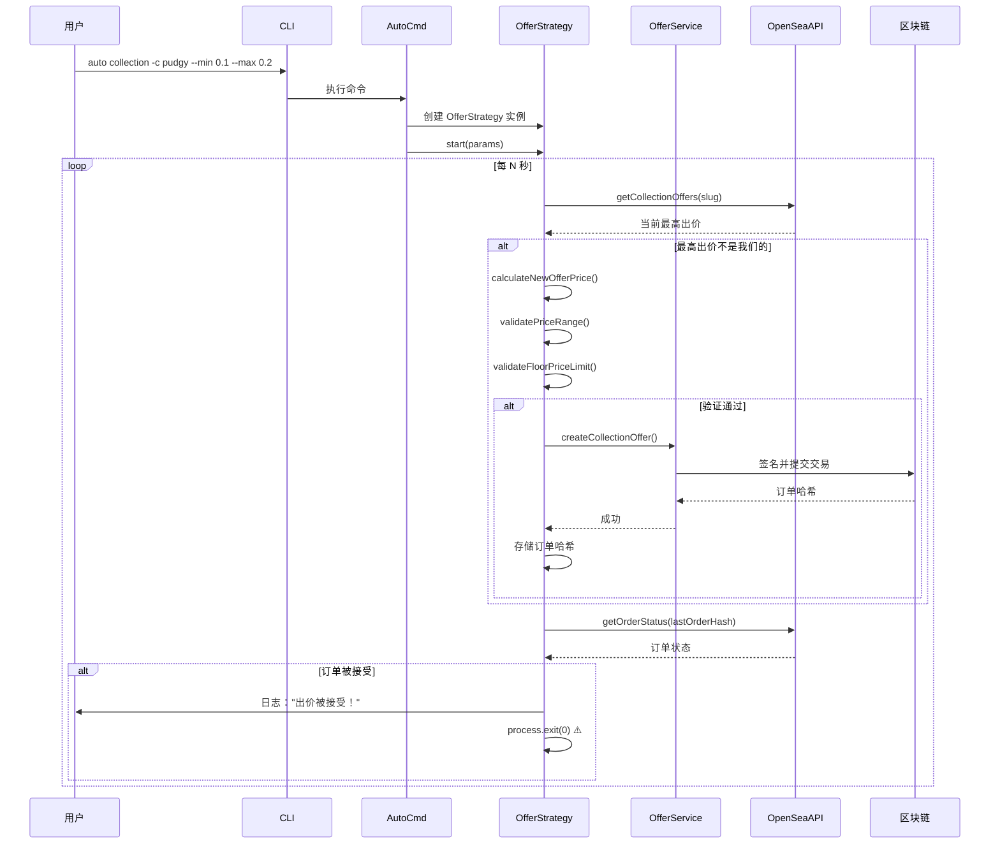

# 组件架构

## OfferService

**职责**：使用验证和错误处理封装 OpenSea SDK 出价创建

**关键接口**：
- `createCollectionOffer(params)` - 创建集合级出价
- `createIndividualOffer(params)` - 创建单个 NFT 出价
- `validateBalance(balance, amount)` - 检查 WETH 余额
- `getWETHBalance(contract, address)` - 查询 WETH 余额

**依赖项**：
- OpenSea SDK (opensea-js) 用于创建出价
- ethers.js 用于 WETH 合约交互
- Logger 用于输出

**技术栈**：JavaScript ES Modules、ethers.js v6、opensea-js v7

**⚠️ 已知问题**：使用 `console.log` 而不是 logger（与其他服务不一致）

**来源**：`src/services/offerService.js`

---

## OfferStrategy

**职责**：实现市场监控和动态定价的自动竞价策略

**关键接口**：
- `start(params)` - 开始自动竞价循环
- `stop()` - 停止自动竞价
- `checkAndCreateOffer(params)` - 主循环迭代（检查市场，根据需要创建出价）
- `calculateNewOfferPrice(currentBest, collectionSlug)` - 价格计算，包含地板价限制

**依赖项**：
- OfferService 用于创建出价
- OpenSeaApi 用于市场数据
- Timer (setInterval) 用于周期性执行

**技术栈**：JavaScript ES Modules、setInterval 用于调度

**⚠️ 复杂度警告**：
- 代码库中最复杂的模块
- 出价被接受时使用 `process.exit(0)`
- 错误处理返回 null 并继续（不重试失败的出价）
- 一次只能监控一个集合/代币

**来源**：`src/services/offerStrategy.js`

---

## OpenSeaApi

**职责**：使用重试逻辑和错误处理封装 OpenSea API v2 调用

**关键接口**：
- `fetchWithRetry(url, options, retries, delay)` - 带重试的 HTTP 客户端
- `getCollectionOffers(slug)` - 获取集合出价
- `getCollectionStats(slug)` - 获取包括地板价的统计数据
- `getCollectionInfo(slug)` - 获取集合元数据
- `getOrderStatus(orderHash)` - 检查出价是否被接受

**依赖项**：
- 原生 fetch API
- Logger

**技术栈**：JavaScript ES Modules、原生 fetch

**实现细节**：
- 3 次重试，1 秒延迟（硬编码）
- 404 返回空数组而不是错误
- 401 立即抛出异常（无重试）

**⚠️ 代码重复**：ReservoirApi 中有类似的重试逻辑

**来源**：`src/services/openseaApi.js`

---

## ReservoirApi

**职责**：为跨市场数据和挂单封装 Reservoir API 调用

**关键接口**：
- `getTopCollections(limit, options)` - 按交易量获取集合
- `getTrendingCollections(options)` - 获取热门集合
- `getCollectionOffers(collectionId)` - 获取出价（Reservoir 格式）

**依赖项**：
- 原生 fetch API
- Logger
- 链配置（根据链选择 API 端点）

**技术栈**：JavaScript ES Modules、原生 fetch

**链特定 URL**：
- 以太坊：`https://api.reservoir.tools`
- Base：`https://api-base.reservoir.tools`
- Sepolia：`https://api-sepolia.reservoir.tools`

**⚠️ 代码重复**：与 OpenSeaApi 有相同的 `fetchWithRetry` 逻辑

**来源**：`src/services/reservoirApi.js`

---

## ScanService

**职责**：通过组合多个数据源分析市场交易机会

**关键接口**：
- `scanTopCollections(options)` - 按交易量扫描并过滤
- `scanTrendingCollections(options)` - 扫描热门集合
- `_processCollections(collections, filters)` - 应用过滤器并计算指标

**依赖项**：
- ReservoirApi 用于集合数据
- OpenSeaApi（目前使用较少，主要是 Reservoir）

**技术栈**：JavaScript ES Modules

**过滤逻辑**：
- 交易量阈值检查
- 销售估算计算
- 价格差距百分比 ((地板价 - 最高出价) / 地板价 * 100)

**⚠️ 硬编码**：分页页面之间延迟 500ms

**来源**：`src/services/scanService.js`

---

## KeyManager

**职责**：安全地加密、存储和管理多个私钥

**关键接口**：
- `static encryptKey(privateKey, name)` - 加密并保存密钥
- `static decryptKey(name?)` - 解密密钥（省略 name 则使用活跃密钥）
- `static listKeys()` - 列出所有存储的密钥
- `static setActiveKey(name)` - 切换活跃密钥
- `static removeKey(name)` - 删除密钥

**依赖项**：
- Node.js crypto 模块（AES-256-GCM）
- ethers.js（验证私钥格式）
- 文件系统（读写 .keys 文件）

**技术栈**：JavaScript ES Modules、Node.js crypto

**安全模型**：
- 算法：AES-256-GCM（认证加密）
- 密钥派生：scrypt(password, salt, 32)
- 存储：JSON 文件，每个密钥有独立的 IV 和认证标签

**⚠️ 严重安全问题**：
```javascript
// src/utils/keyManager.js:10-12
export const SALT = Buffer.from('opensea-offer-maker-salt', 'utf8');
export const PASSWORD = 'opensea-offer-maker-password';
```
源代码中的硬编码盐和密码意味着任何有源代码的人都可以解密密钥。

**缓解措施**：用户可以设置 `ENCRYPTION_KEY` 环境变量自定义密钥。

**建议**：仅用于低价值钱包，不要存储主要资产。

**来源**：`src/utils/keyManager.js`

---

## 组件交互图

### 自动竞价流程


