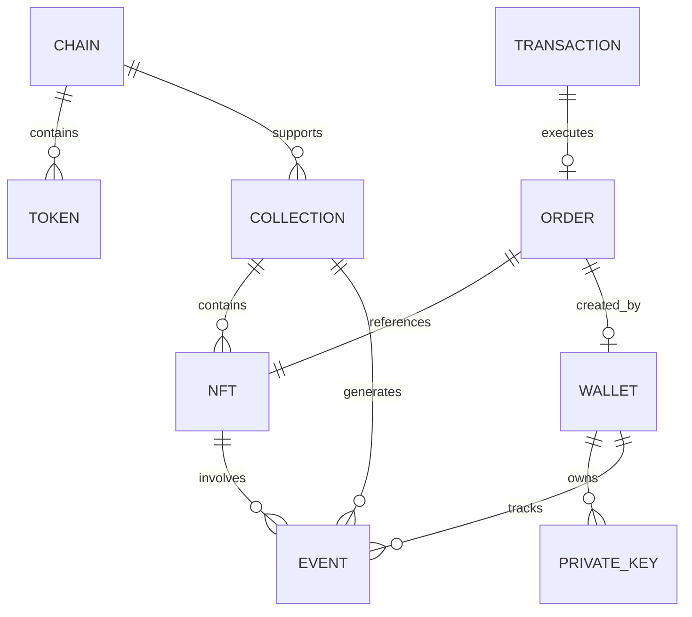

# 数据模型架构

**注意**：作为 CLI 工具，系统使用文件存储和内存结构，没有传统数据库。数据模型主要包括配置对象、缓存结构和事件存储格式。

## 核心配置数据

### 链配置模型

**用途**：定义支持的区块链网络及其完整参数

**数据源**：`src/constants/chains.js`

**数据结构**：
```javascript
{
  [chainId]: {
    name: string,              // 链标识符
    chain: Chain,              // OpenSea SDK 链常量
    wethAddress: string,       // WETH 合约地址
    chainId: number,           // 区块链 ID
    alchemyNetwork: string,    // Alchemy 网络名称
    rpcUrl: string,            // RPC 端点 URL
    apiChainName: string,      // OpenSea API 链名称
    nativeCurrency: {          // 原生代币信息
      symbol: string,
      name: string,
      decimals: number,
      address: string
    }
  }
}
```

**支持的链**：
- **ethereum**: 以太坊主网 (ChainId: 1)
- **base**: Base 网络 (ChainId: 8453)
- **arbitrum**: Arbitrum One (ChainId: 42161)
- **ronin**: Ronin 网络 (ChainId: 2020)
- **polygon**: Polygon (ChainId: 137)
- **apechain**: ApeChain (ChainId: 33139)
- **sepolia**: Sepolia 测试网 (ChainId: 11155111)

### 代币配置模型

**用途**：定义每条链上支持的代币及其属性

**数据源**：`src/config/tokens.js`

**数据结构**：
```javascript
{
  [chainId]: {
    [tokenSymbol]: {
      symbol: string,           // 代币符号 (ETH, WETH, 等)
      address: string,          // 合约地址 (原生代币为 null)
      decimals: number,         // 代币精度
      isNative: boolean,        // 是否为原生代币
      name?: string            // 代币名称 (可选)
    }
  }
}
```

**关键代币映射**：
- **以太坊网络**: ETH (原生), WETH (0xC02aaA39b223FE8D0A0e5C4F27eAD9083C756Cc2)
- **Base 网络**: ETH (原生), WETH (0x4200000000000000000000000000000000000006)
- **Sepolia 测试网**: ETH (原生), WETH (0xfFf9976782d46CC05630D1f6eBAb18b2324d6B14)

## 安全存储模型

### 私钥加密存储

**用途**：本地安全存储多个加密的私钥

**存储位置**：`.keys` 文件 (JSON 格式，gitignored)

**加密方案**：AES-256-GCM
- 密钥派生：scrypt(PASSWORD, SALT, 32)
- 固定盐值：'opensea-offer-maker-salt'
- 固定密码：'opensea-offer-maker-password'

**数据结构**：
```javascript
{
  "keys": [
    {
      "name": string,           // 用户定义的密钥名称
      "address": string,        // 以太坊地址
      "encryptedKey": string,   // AES-256-GCM 加密的私钥
      "iv": string,            // 初始化向量 (128-bit)
      "authTag": string,       // GCM 认证标签 (128-bit)
      "isActive": boolean       // 是否为当前活跃密钥
    }
  ]
}
```

**安全特性**：
- 每个密钥独立加密
- 支持多密钥管理和切换
- 地址验证和格式检查
- 内存中明文最小化

### 配置管理存储

**用途**：用户配置和偏好的持久化存储

**存储位置**：用户配置目录 (JSON 格式)

**配置类型**：
```javascript
{
  defaultChain: string,        // 默认链配置
  userPreferences: {           // 用户偏好设置
    language: string,          // 界面语言
    currency: string,          // 显示货币
    notifications: boolean     // 通知开关
  },
  monitoringConfig: {          // 监控配置
    verbosity: string,         // 日志详细程度
    retentionDays: number,     // 日志保留天数
    refreshInterval: number     // 刷新间隔
  },
  cacheConfig: {              // 缓存配置
    maxSize: number,          // 最大缓存大小
    ttl: number,              // 默认过期时间
    enableCompression: boolean // 压缩开关
  }
}
```

## 缓存数据模型

### NFT 元数据缓存

**用途**：缓存 NFT 元数据，减少重复 API 调用

**存储位置**：`.cache/nfts/{contractAddress}_{tokenId}.json`

**数据结构**：
```javascript
{
  contractAddress: string,     // 合约地址
  tokenId: string,            // Token ID
  metadata: {                 // NFT 元数据
    name: string,             // NFT 名称
    description: string,      // 描述
    image: string,            // 图片 URL
    attributes: [             // 属性列表
      {
        trait_type: string,   // 特征类型
        value: string,        // 特征值
      }
    ],
    collection: {             // 集合信息
      name: string,
      slug: string,
      verified: boolean
    }
  },
  cachedAt: timestamp,        // 缓存时间戳
  expiresAt: timestamp,       // 过期时间
  checksum: string            // 数据校验和
}
```

### 集合统计数据缓存

**用途**：缓存集合统计数据，支持地板价和交易量信息

**存储位置**：`.cache/collections/{collectionSlug}.json`

**数据结构**：
```javascript
{
  slug: string,               // 集合 slug
  stats: {
    floorPrice: number,       // 地板价
    totalVolume: number,      // 总交易量
    marketCap: number,        // 市值
    numOwners: number,        // 持有者数量
    totalSupply: number,      // 总供应量
    volumeHistory: {          // 交易量历史
      "1d": number,          // 24小时
      "7d": number,          // 7天
      "30d": number         // 30天
    },
    salesHistory: {           // 销售历史
      "1d": number,
      "7d": number,
      "30d": number
    }
  },
  bestOffer: {               // 最高出价
    price: number,
    maker: string,
    validUntil: timestamp
  },
  bestListing: {             // 最佳挂单
    price: number,
    maker: string,
    validUntil: timestamp
  },
  cachedAt: timestamp,
  expiresAt: timestamp
}
```

## 事件数据模型

### 实时事件存储

**用途**：存储 OpenSea Stream API 接收的实时事件

**存储位置**：`.cache/events/{wallet}_{chain}.jsonl` (JSONL 格式)

**事件类型和结构**：

#### 销售事件 (sale)
```javascript
{
  event_type: "sale",
  timestamp: number,
  chain: string,
  collection: {
    slug: string,
    name: string,
    contract_address: string
  },
  nft: {
    contract_address: string,
    token_id: string,
    name: string,
    image_url: string
  },
  transaction: {
    hash: string,
    timestamp: number,
    block_number: number
  },
  payment: {
    amount: number,
    symbol: string,
    decimals: number,
    usd_value: number
  },
  seller: string,
  buyer: string
}
```

#### 转账事件 (transfer)
```javascript
{
  event_type: "transfer",
  timestamp: number,
  chain: string,
  collection: { ... },
  nft: { ... },
  transaction: { ... },
  from_address: string,
  to_address: string,
  transfer_type: "transfer" | "mint" | "burn"
}
```

#### 挂单事件 (listing)
```javascript
{
  event_type: "listing",
  timestamp: number,
  chain: string,
  collection: { ... },
  nft: { ... },
  order_hash: string,
  maker: string,
  price: {
    amount: number,
    symbol: string,
    decimals: number,
    usd_value: number
  },
  expiration: timestamp,
  marketplace: "opensea" | "blur" | "other"
}
```

#### 出价事件 (bid)
```javascript
{
  event_type: "bid",
  timestamp: number,
  chain: string,
  collection: { ... },
  nft: { ... },
  order_hash: string,
  maker: string,
  price: { ... },
  expiration: timestamp,
  marketplace: string
}
```

#### 取消事件 (cancel)
```javascript
{
  event_type: "cancel",
  timestamp: number,
  chain: string,
  collection: { ... },
  nft: { ... },
  order_hash: string,
  maker: string,
  reason: "user_cancelled" | "expired" | "filled"
}
```

## 监控数据模型

### 监控状态存储

**用途**：存储实时监控的状态和配置

**存储位置**：`.cache/monitoring/{wallet}_{chain}_status.json`

**数据结构**：
```javascript
{
  monitoringState: {
    isActive: boolean,        // 监控是否活跃
    startTime: timestamp,     // 开始时间
    lastEventTime: timestamp, // 最后事件时间
    eventsProcessed: number,   // 处理的事件数
    connectionStatus: "connected" | "disconnected" | "reconnecting"
  },
  configuration: {
    walletAddress: string,    // 监控的钱包地址
    chain: string,           // 监控的链
    collections: string[],   // 监控的集合列表
    eventTypes: string[],    // 监控的事件类型
    filters: {               // 事件过滤器
      minValue: number,
      maxValue: number,
      traits: Array<{type: string, value: string}>
    }
  },
  statistics: {
    eventsByType: {           // 按类型统计事件
      sale: number,
      transfer: number,
      listing: number,
      bid: number,
      cancel: number
    },
    totalValue: {             // 总价值统计
      sales: number,
      listings: number,
      bids: number
    },
    topCollections: Array<{   // 热门集合
      slug: string,
      eventCount: number,
      totalValue: number
    }>
  },
  lastUpdated: timestamp
}
```

## 交易数据模型

### 订单跟踪模型

**用途**：跟踪出价和购买订单的状态

**数据结构**：
```javascript
{
  orderId: string,           // 订单哈希或 ID
  type: "offer" | "buy",     // 订单类型
  status: "pending" | "filled" | "cancelled" | "expired",
  maker: string,             // 订单创建者
  collection: {
    slug: string,
    contractAddress: string
  },
  nft: {
    tokenId?: string,        // 仅特定 NFT 订单
    criteria?: any          // 集合出价条件
  },
  price: {
    amount: number,
    symbol: string,
    decimals: number,
    usdValue: number
  },
  expiration: timestamp,
  createdAt: timestamp,
  updatedAt: timestamp,
  transactionHash?: string,  // 执行交易的哈希
  marketplace: string       // 市场平台
}
```

### 交易历史模型

**用途**：记录执行的交易历史

**数据结构**：
```javascript
{
  transactionHash: string,
  type: "offer" | "buy" | "swap" | "send",
  status: "success" | "failed" | "pending",
  chain: string,
  from: string,
  to: string,
  value: {
    amount: number,
    symbol: string,
    decimals: number,
    usdValue: number
  },
  gasUsed?: {
    amount: number,
    symbol: string,
    usdValue: number
  },
  blockNumber?: number,
  timestamp: number,
  relatedOrderId?: string,
  description: string
}
```

## 数据完整性约束

### 验证规则

1. **地址格式**：所有以太坊地址必须符合 0x + 40 位十六进制格式
2. **链一致性**：代币和链配置必须保持一致性
3. **时间戳**：所有时间戳使用 Unix 时间戳（秒级精度）
4. **数值精度**：代币金额必须考虑 decimals 精度
5. **JSON 格式**：所有存储文件必须是有效的 JSON 格式

### 数据关系



这些数据模型支持系统的高效运行，提供了完整的数据持久化、缓存和事件处理能力。