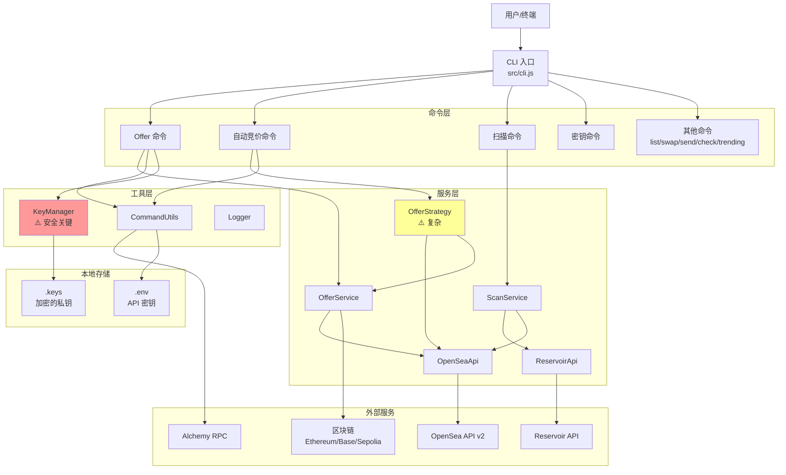

# 高层架构

## 技术概述

OpenSea Offer Maker 是一个**模块化 CLI 应用程序**，遵循三层架构模式：
1. **命令层** - 使用 Commander.js 的 CLI 接口
2. **服务层** - 核心业务逻辑和 API 集成
3. **工具层** - 共享工具和辅助函数

系统通过 Alchemy RPC 与外部 NFT 市场 API（OpenSea、Reservoir）和区块链网络（以太坊、Base、Sepolia）集成。私钥使用 AES-256-GCM 加密存储在本地。架构通过配置驱动设计支持多链操作。

**核心设计原则**（已实现）：
- 关注点分离（命令 → 服务 → API）
- 配置优于硬编码（尽管存在一些硬编码作为技术债务）
- 安全意识的密钥管理
- CLI 优先的用户体验

## 高层概览

**架构风格**：模块化单体 CLI 应用程序

**仓库结构**：单仓库（非 monorepo），模块分离清晰

**服务架构**：所有服务在单个 Node.js 进程中运行，同步命令执行

**主要用户流程**：
```
用户 → CLI 命令 → 命令处理器 → 服务层 → 外部 API/区块链
                                            ↓
用户 ← 显示结果 ← 处理响应 ← 响应数据
```

**关键架构决策**：
1. **CLI 而非 GUI**：面向高级用户和自动化优化
2. **直接 API 集成**：无后端服务器，CLI 直接调用 API
3. **本地密钥存储**：加密私钥本地存储（非远程）
4. **同步执行**：命令运行完成，无后台服务（自动竞价计时器除外）

## 高层项目架构图



## 架构和设计模式

- **模块化 CLI 模式**：CLI 接口（命令）和业务逻辑（服务）清晰分离 - _理由：_ 提高 CLI 应用程序的可测试性、代码复用和可维护性
- **服务层模式**：业务逻辑封装在专门的服务类中 - _理由：_ 促进单一职责，使用模拟依赖更容易测试
- **策略模式**：OfferStrategy 类中的自动竞价逻辑 - _理由：_ 封装复杂的竞价算法，允许未来的策略变化
- **包装器模式**：API 客户端封装外部服务并带有重试逻辑 - _理由：_ 抽象 API 复杂性，提供一致的错误处理
- **配置模式**：通过配置对象支持多链 - _理由：_ 无需代码更改即可轻松扩展到新链
