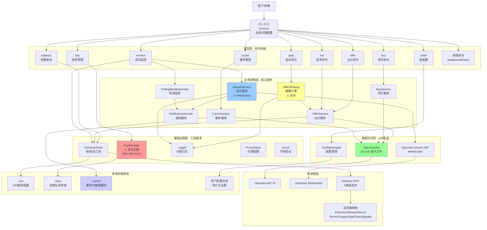

# 高层架构设计

## 技术概述

OpenSea Offer Maker 是一个**成熟的企业级 CLI 应用程序**，采用分层架构模式：
1. **表现层** - Commander.js CLI 框架和命令路由
2. **业务逻辑层** - 核心服务和策略引擎
3. **数据访问层** - API 集成和缓存系统
4. **基础设施层** - 工具类、配置管理和安全服务

系统通过多重代理支持与外部服务集成，包括 OpenSea API v2、OpenSea Stream API、Alchemy RPC，支持 6 条区块链网络。采用文件缓存系统和事件流处理，实现了从简单出价工具到完整 NFT 交易平台的演进。

**核心设计原则**（已实现并验证）：
- **关注点分离**：清晰的四层架构，职责明确
- **配置驱动**：多链配置支持，环境变量管理
- **安全优先**：AES-256-GCM 加密，临时私钥支持
- **实时处理**：WebSocket 流式 API 集成
- **容错设计**：重试机制、代理支持、错误恢复

## 高层概览

**架构风格**：模块化单体应用，支持实时流处理

**代码规模**：17,843 行生产代码，84.36% 测试覆盖率

**部署模式**：NPM 包，本地 CLI 工具，无服务器依赖

**并发模型**：单线程事件循环 + WebSocket 异步处理

**主要数据流**：
```
用户输入 → CLI 解析 → 命令路由 → 服务处理 → API/区块链调用
                ↓
事件流 ← WebSocket 监控 ← 缓存更新 ← 结果处理 ← 响应数据
                ↓
用户界面 ← 格式化输出 ← 通知系统 ← 事件处理
```

**关键架构决策**：
1. **CLI-first 设计**：面向专业用户和自动化场景
2. **直接 API 集成**：无中间层，减少延迟
3. **混合存储策略**：文件缓存 + 加密本地存储
4. **实时监控能力**：WebSocket + 轮询双重机制
5. **多链抽象层**：统一接口支持 6 条区块链

## 高层项目架构图



## 架构模式和设计决策

### 实现的设计模式

- **分层架构模式**：四层架构（表现层→业务逻辑层→数据访问层→基础设施层）
  - **理由**：清晰的职责分离，便于测试和维护
  - **实现**：CLI命令→服务类→API封装→工具函数

- **服务层模式**：业务逻辑封装在专门的服务类中
  - **理由**：促进单一职责，依赖注入，提高可测试性
  - **实现**：8个核心服务类，清晰的接口定义

- **策略模式**：OfferStrategy 类中的自动竞价算法
  - **理由**：封装复杂的竞价策略，支持算法切换
  - **实现**：价格计算、地板价验证、出价时机判断

- **观察者模式**：实时监控和通知系统
  - **理由**：事件驱动的实时响应
  - **实现**：StreamService → NotificationService → 用户界面

- **工厂模式**：链配置和钱包创建
  - **理由**：统一的多链支持，隐藏创建复杂性
  - **实现**：CommandUtils.getWallet(), 链配置工厂

- **包装器模式**：API 客户端封装
  - **理由**：抽象外部API复杂性，统一错误处理
  - **实现**：OpenSeaApi 类，重试机制，代理支持

- **缓存模式**：文件系统缓存
  - **理由**：减少API调用，提高响应速度
  - **实现**：CacheService，JSON/JSONL格式存储

### 关键架构权衡

1. **CLI vs Web界面**
   - **选择**：CLI优先
   - **理由**：目标用户是专业交易者，需要自动化和脚本集成

2. **本地存储 vs 云存储**
   - **选择**：本地加密存储
   - **理由**：安全性，用户控制，离线工作能力

3. **同步 vs 异步处理**
   - **选择**：混合模式
   - **理由**：命令同步执行，监控异步处理，平衡响应性和实时性

4. **单进程 vs 多进程**
   - **选择**：单进程 + 事件循环
   - **理由**：简化部署，减少资源消耗，Node.js异步特性充分利用

5. **直接API vs SDK**
   - **选择**：混合使用
   - **理由**：OpenSea SDK用于复杂操作，直接API用于简单查询，最优性能
