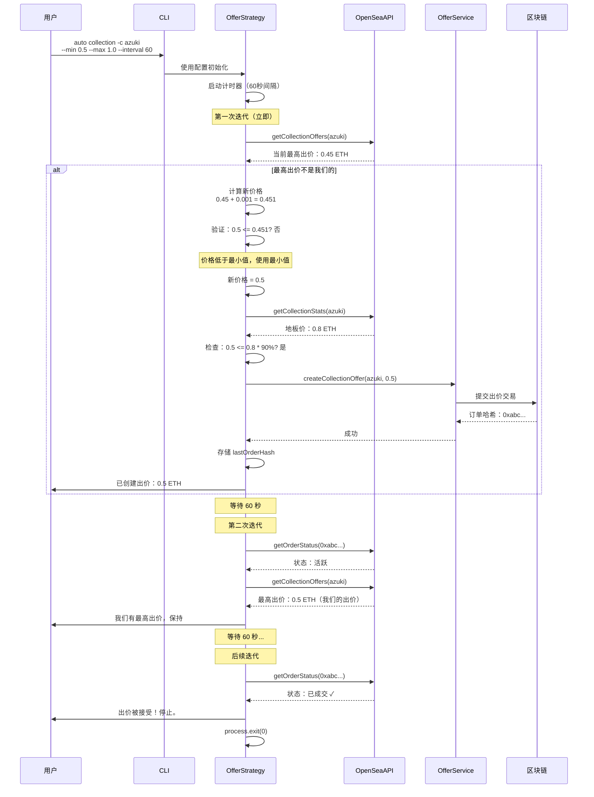
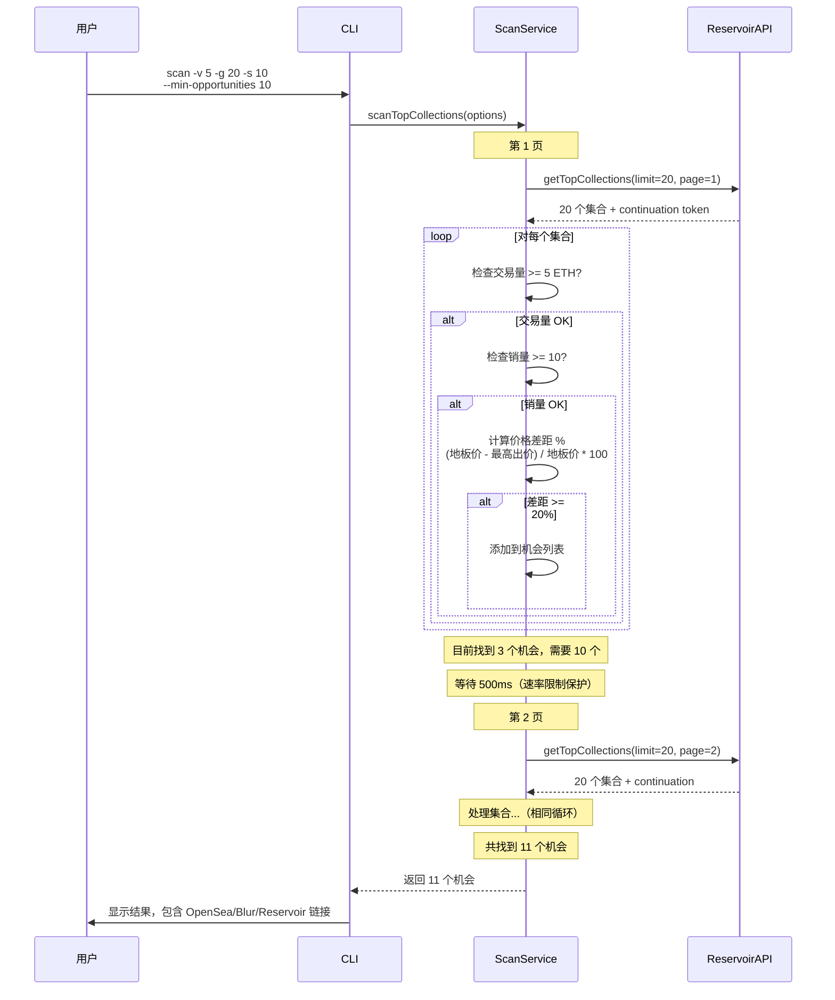
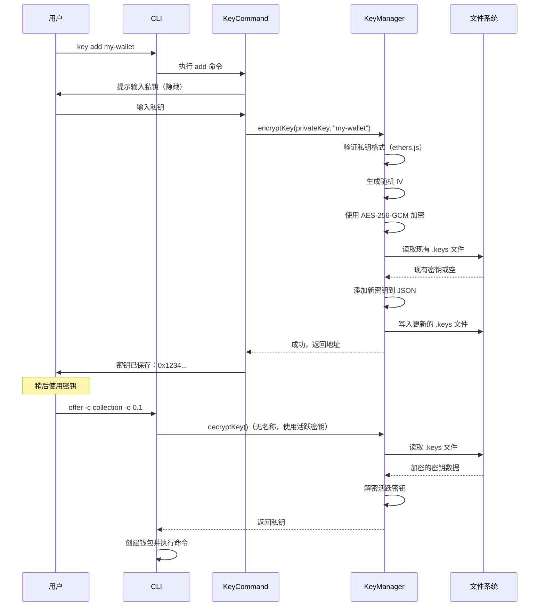

# 核心工作流程

## 自动竞价工作流程

```mermaid
sequenceDiagram
    participant User as 用户
    participant CLI
    participant Strategy as OfferStrategy
    participant OpenSeaAPI
    participant OfferService
    participant Blockchain as 区块链

    User->>CLI: auto collection -c azuki<br/>--min 0.5 --max 1.0 --interval 60
    CLI->>Strategy: 使用配置初始化
    Strategy->>Strategy: 启动计时器（60秒间隔）

    Note over Strategy: 第一次迭代（立即）

    Strategy->>OpenSeaAPI: getCollectionOffers(azuki)
    OpenSeaAPI-->>Strategy: 当前最高出价：0.45 ETH

    alt 最高出价不是我们的
        Strategy->>Strategy: 计算新价格<br/>0.45 + 0.001 = 0.451
        Strategy->>Strategy: 验证：0.5 <= 0.451? 否
        Note over Strategy: 价格低于最小值，使用最小值
        Strategy->>Strategy: 新价格 = 0.5

        Strategy->>OpenSeaAPI: getCollectionStats(azuki)
        OpenSeaAPI-->>Strategy: 地板价：0.8 ETH
        Strategy->>Strategy: 检查：0.5 <= 0.8 * 90%? 是

        Strategy->>OfferService: createCollectionOffer(azuki, 0.5)
        OfferService->>Blockchain: 提交出价交易
        Blockchain-->>OfferService: 订单哈希：0xabc...
        OfferService-->>Strategy: 成功
        Strategy->>Strategy: 存储 lastOrderHash
        Strategy->>User: 已创建出价：0.5 ETH
    end

    Note over Strategy: 等待 60 秒

    Note over Strategy: 第二次迭代

    Strategy->>OpenSeaAPI: getOrderStatus(0xabc...)
    OpenSeaAPI-->>Strategy: 状态：活跃

    Strategy->>OpenSeaAPI: getCollectionOffers(azuki)
    OpenSeaAPI-->>Strategy: 最高出价：0.5 ETH（我们的出价）
    Strategy->>User: 我们有最高出价，保持

    Note over Strategy: 等待 60 秒...

    Note over Strategy: 后续迭代

    Strategy->>OpenSeaAPI: getOrderStatus(0xabc...)
    OpenSeaAPI-->>Strategy: 状态：已成交 ✓
    Strategy->>User: 出价被接受！停止。
    Strategy->>Strategy: process.exit(0)
```

---

## 市场扫描工作流程

```mermaid
sequenceDiagram
    participant User as 用户
    participant CLI
    participant ScanService
    participant ReservoirAPI

    User->>CLI: scan -v 5 -g 20 -s 10<br/>--min-opportunities 10
    CLI->>ScanService: scanTopCollections(options)

    Note over ScanService: 第 1 页

    ScanService->>ReservoirAPI: getTopCollections(limit=20, page=1)
    ReservoirAPI-->>ScanService: 20 个集合 + continuation token

    loop 对每个集合
        ScanService->>ScanService: 检查交易量 >= 5 ETH?
        alt 交易量 OK
            ScanService->>ScanService: 检查销量 >= 10?
            alt 销量 OK
                ScanService->>ScanService: 计算价格差距 %<br/>(地板价 - 最高出价) / 地板价 * 100
                alt 差距 >= 20%
                    ScanService->>ScanService: 添加到机会列表
                end
            end
        end
    end

    Note over ScanService: 目前找到 3 个机会，需要 10 个

    Note over ScanService: 等待 500ms（速率限制保护）

    Note over ScanService: 第 2 页

    ScanService->>ReservoirAPI: getTopCollections(limit=20, page=2)
    ReservoirAPI-->>ScanService: 20 个集合 + continuation

    Note over ScanService: 处理集合...（相同循环）

    Note over ScanService: 共找到 11 个机会

    ScanService-->>CLI: 返回 11 个机会
    CLI->>User: 显示结果，包含 OpenSea/Blur/Reservoir 链接
```

---

## 密钥管理工作流程

```mermaid
sequenceDiagram
    participant User as 用户
    participant CLI
    participant KeyCmd as KeyCommand
    participant KeyMgr as KeyManager
    participant FS as 文件系统

    User->>CLI: key add my-wallet
    CLI->>KeyCmd: 执行 add 命令
    KeyCmd->>User: 提示输入私钥（隐藏）
    User->>KeyCmd: 输入私钥
    KeyCmd->>KeyMgr: encryptKey(privateKey, "my-wallet")

    KeyMgr->>KeyMgr: 验证私钥格式（ethers.js）
    KeyMgr->>KeyMgr: 生成随机 IV
    KeyMgr->>KeyMgr: 使用 AES-256-GCM 加密
    KeyMgr->>FS: 读取现有 .keys 文件
    FS-->>KeyMgr: 现有密钥或空
    KeyMgr->>KeyMgr: 添加新密钥到 JSON
    KeyMgr->>FS: 写入更新的 .keys 文件
    KeyMgr-->>KeyCmd: 成功，返回地址
    KeyCmd->>User: 密钥已保存：0x1234...

    Note over User: 稍后使用密钥

    User->>CLI: offer -c collection -o 0.1
    CLI->>KeyMgr: decryptKey()（无名称，使用活跃密钥）
    KeyMgr->>FS: 读取 .keys 文件
    FS-->>KeyMgr: 加密的密钥数据
    KeyMgr->>KeyMgr: 解密活跃密钥
    KeyMgr-->>CLI: 返回私钥
    CLI->>CLI: 创建钱包并执行命令
```
