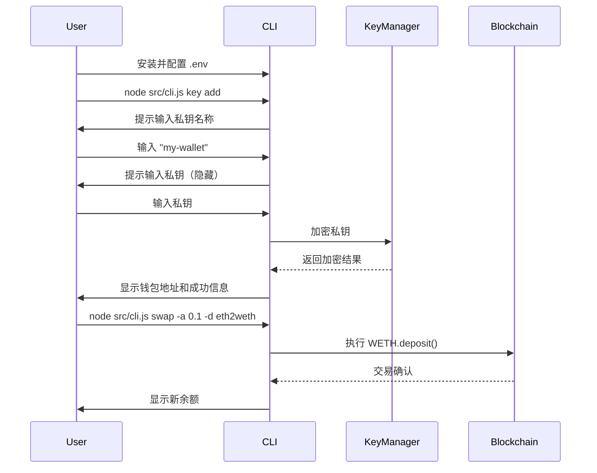
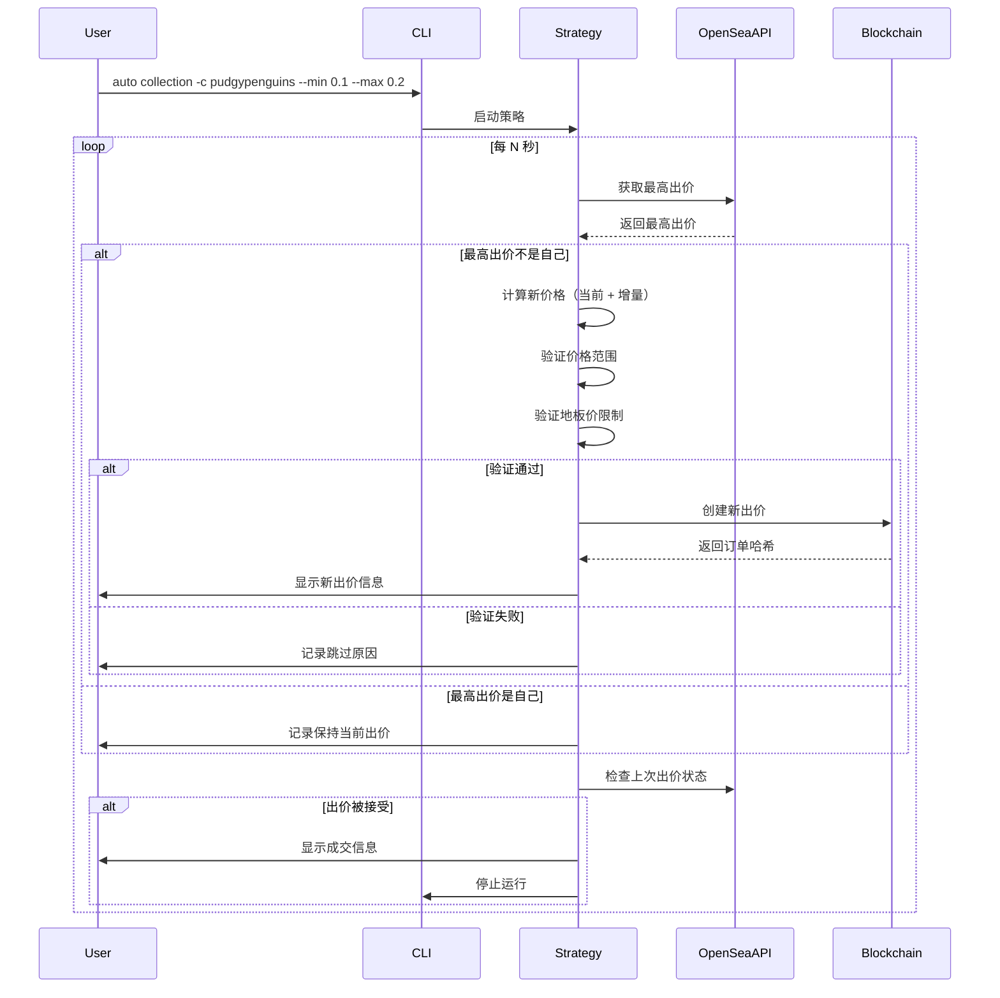
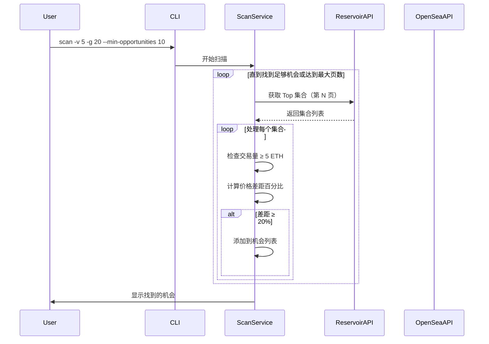

# OpenSea Offer Maker - 产品需求文档 (PRD)

## 文档信息

| 项目 | 内容 |
|------|------|
| **产品名称** | OpenSea Offer Maker |
| **版本** | v0.0.6 |
| **文档版本** | v1.0 |
| **创建日期** | 2025-10-08 |
| **文档类型** | 棕地项目 PRD（基于现有代码反推） |
| **项目仓库** | opensea-offer-maker |

## 变更日志

| 日期 | 版本 | 描述 | 作者 |
|------|------|------|------|
| 2025-10-08 | 1.0 | 基于现有代码创建初始 PRD | Winston (Architect) |

---

## 1. 产品概述

### 1.1 产品定位

OpenSea Offer Maker 是一个面向 NFT 交易者的命令行工具（CLI），专注于在 OpenSea 和 Blur 等市场上自动化和优化 NFT 出价策略。该工具支持多链操作（以太坊、Base、Sepolia），提供从单次出价到智能自动竞价的全方位功能。

### 1.2 目标用户

- **NFT 专业交易者**：需要快速、高效地在多个 NFT 项目上进行出价
- **NFT 投资者**：希望通过自动化策略在地板价以下捕获交易机会
- **技术型用户**：熟悉命令行界面，追求效率和自动化
- **套利交易者**：需要扫描市场机会并快速执行交易

### 1.3 核心价值主张

1. **自动化竞价策略** - 根据市场最高出价自动调整报价，无需人工监控
2. **多链支持** - 一个工具覆盖以太坊主网、Base 和 Sepolia 测试网
3. **安全的私钥管理** - AES-256-GCM 加密，支持多密钥管理
4. **市场机会扫描** - 智能扫描交易量高、价格差距大的项目
5. **跨市场挂单** - 同时在 OpenSea 和 Blur 上创建挂单
6. **地板价保护** - 设置出价不超过地板价的特定百分比

---

## 2. 功能需求

### 2.1 核心功能模块

#### 2.1.1 出价管理 (Offer Management)

**功能描述**：创建和管理 NFT 出价

**用户故事**：
- 作为交易者，我希望能够为单个 NFT 创建出价
- 作为交易者，我希望能够为整个集合创建批量出价
- 作为交易者，我希望能够基于 NFT 特征（trait）创建有针对性的出价

**功能详情**：

##### A. 单个 NFT 出价 (`offer` 命令)

```bash
node src/cli.js offer [options]
```

**参数**：
- `-a, --address <address>` - NFT 合约地址（用于单个 NFT）
- `-t, --token-id <tokenId>` - Token ID（用于单个 NFT）
- `-c, --collection <slug>` - 集合 slug（用于集合出价）
- `-o, --offer-amount <amount>` - 出价金额（WETH）[必需]
- `-e, --expiration-minutes <minutes>` - 过期时间（分钟）[默认: 15]
- `--trait-type <type>` - 特征类型（仅用于集合出价）
- `--trait-value <value>` - 特征值（仅用于集合出价）
- `--chain <chain>` - 链选择（ethereum/base/sepolia）[默认: ethereum]
- `--private-key <key>` - 临时私钥（可选）

**业务逻辑**：
1. 验证用户提供的参数（集合或单个 NFT，二选一）
2. 检查 WETH 余额是否足够
3. 计算过期时间戳
4. 调用 OpenSea SDK 创建出价
5. 返回订单哈希（order hash）

**示例**：
```bash
# 为集合创建出价
node src/cli.js offer -c scribblebears -o 0.1 -e 60 --chain base

# 为单个 NFT 创建出价
node src/cli.js offer -a 0xf3ec2d6394fc899a5dc1823a205670ebb30939cc -t 123 -o 0.05 -e 30
```

**实现文件**：`src/commands/offerCommand.js`

---

#### 2.1.2 自动竞价 (Auto Bidding)

**功能描述**：自动化出价策略，持续监控市场并动态调整出价

**用户故事**：
- 作为交易者，我希望工具能自动监控集合的最高出价并在我的预算范围内自动提高出价
- 作为交易者，我希望设置出价上限，避免出价超过地板价的一定百分比
- 作为交易者，我希望当我的出价被接受时，工具能自动停止

**功能详情**：

##### A. 自动集合出价 (`auto collection` 命令)

```bash
node src/cli.js auto collection [options]
```

**参数**：
- `-c, --collection <slug>` - 集合 slug [必需]
- `--min <price>` - 最低出价（WETH）[必需]
- `--max <price>` - 最高出价（WETH）[必需]
- `--increment <amount>` - 价格增量 [默认: 0.001]
- `--interval <seconds>` - 检查间隔（秒）[默认: 60]
- `--floor-percentage <percentage>` - 地板价百分比限制 [默认: 90]
- `--chain <chain>` - 链选择 [默认: ethereum]
- `--debug` - 启用调试日志

**业务逻辑**：
1. 获取集合的当前最高出价
2. 如果最高出价不是自己的，计算新出价（当前最高 + 增量）
3. 验证新出价是否在用户设定的范围内（min-max）
4. 验证新出价是否不超过地板价的指定百分比
5. 创建新出价
6. 每隔指定时间重复检查
7. 如果上一次出价被接受，自动停止

**示例**：
```bash
node src/cli.js auto collection -c scribblebears \
  --min 0.01 --max 0.035 \
  --floor-percentage 80 \
  --interval 30 \
  --chain base
```

**实现文件**：`src/commands/autoOfferCommand.js`, `src/services/offerStrategy.js`

##### B. 自动单品出价 (`auto token` 命令)

```bash
node src/cli.js auto token [options]
```

**参数**：
- `-a, --address <address>` - NFT 合约地址 [必需]
- `-t, --token-id <tokenId>` - Token ID [必需]
- `-c, --collection <slug>` - 集合 slug [必需]
- `--min <price>` - 最低出价（WETH）[必需]
- `--max <price>` - 最高出价（WETH）[必需]
- `--increment <amount>` - 价格增量 [默认: 0.001]
- `--interval <seconds>` - 检查间隔（秒）[默认: 60]
- `--floor-percentage <percentage>` - 地板价百分比限制（可选）

**业务逻辑**：类似集合出价，但针对单个 NFT

**实现文件**：`src/commands/autoOfferCommand.js`, `src/services/offerStrategy.js`

---

#### 2.1.3 出价查询 (Check Offers)

**功能描述**：查看集合的当前出价情况和统计数据

**用户故事**：
- 作为交易者，我希望快速查看某个集合的地板价、交易量和当前最高出价
- 作为交易者，我希望了解最高出价与地板价之间的差距

**功能详情**：

```bash
node src/cli.js check -c <collection> [options]
```

**参数**：
- `-c, --collection <slug>` - 集合 slug [必需]
- `--chain <chain>` - 链选择
- `--debug` - 启用调试日志

**显示信息**：
1. **集合统计**：
   - 地板价
   - 总供应量
   - 市值
2. **24 小时统计**：
   - 交易量及变化百分比
   - 销售数量及变化
   - 平均价格
3. **7 天统计**（同上）
4. **30 天统计**（同上）
5. **历史总计统计**
6. **最高出价**：
   - 最高出价价格
   - 与地板价的差距（金额和百分比）
7. **Top 10 出价**（按单价排序）

**实现文件**：`src/commands/checkOffersCommand.js`, `src/services/openseaApi.js`

---

#### 2.1.4 市场扫描 (Market Scanning)

**功能描述**：扫描市场以发现交易机会

**用户故事**：
- 作为交易者，我希望工具能帮我找到交易活跃且价格差距大的项目
- 作为交易者，我希望能够根据交易量、地板价等条件筛选项目

**功能详情**：

##### A. Top 集合扫描 (`scan` 命令)

```bash
node src/cli.js scan [options]
```

**参数**：
- `-v, --volume <volume>` - 最低 24h 交易量（ETH）
- `-g, --gap <gap>` - 最小价格差距百分比
- `-s, --sales <sales>` - 最低估计 24h 销量
- `-t, --top <number>` - 扫描前 N 个集合 [默认: 100]
- `--min-floor <price>` - 最低地板价（ETH）
- `--max-floor <price>` - 最高地板价（ETH）
- `--min-opportunities <number>` - 找到 N 个机会后停止 [默认: 10]
- `--chain <chain>` - 链选择

**业务逻辑**：
1. 从 Reservoir API 获取按 24h 交易量排序的集合
2. 对每个集合：
   - 检查 24h 交易量是否满足最低要求
   - 检查估计销量是否满足要求
   - 获取地板价和最高出价
   - 计算价格差距百分比 = (地板价 - 最高出价) / 地板价 * 100
   - 如果差距满足最小要求，加入结果
3. 分页扫描直到找到足够数量的机会或达到最大页数
4. 返回机会列表，包含 OpenSea、Reservoir 和 Blur（仅以太坊）链接

**示例**：
```bash
node src/cli.js scan -v 1 -g 20 -s 5 --min-opportunities 10
```

**实现文件**：`src/commands/scanCommand.js`, `src/services/scanService.js`, `src/services/reservoirApi.js`

##### B. 热门集合扫描 (`trending` 命令)

```bash
node src/cli.js trending [options]
```

**参数**：
- `-v, --volume <volume>` - 最低 24h 交易量（ETH）[默认: 1]
- `-g, --gap <gap>` - 最小价格差距百分比 [默认: 20]
- `-p, --period <period>` - 时间周期（1h, 6h, 24h, 7d, 30d）[默认: 24h]
- `-l, --limit <limit>` - 获取集合数量 [默认: 20]
- `--chain <chain>` - 链选择

**业务逻辑**：
1. 从 Reservoir API 获取指定时间段的热门集合
2. 过滤交易量低于最小值的集合
3. 显示每个集合的详细统计：
   - 地板价及变化百分比
   - 24h 交易量及变化百分比
   - 供应量和在售数量
   - 持有者数量
   - Reservoir 链接

**实现文件**：`src/commands/trendingCommand.js`, `src/services/scanService.js`, `src/services/reservoirApi.js`

---

#### 2.1.5 跨市场挂单 (Cross-Market Listing)

**功能描述**：在多个 NFT 市场上同时创建挂单

**用户故事**：
- 作为卖家，我希望能同时在 OpenSea 和 Blur 上挂单，提高曝光率
- 作为卖家，我希望能基于地板价动态设置挂单价格

**功能详情**：

```bash
node src/cli.js list [options]
```

**参数**：
- `-a, --address <address>` - NFT 合约地址 [必需]
- `-t, --token-id <tokenId>` - Token ID [必需]
- `-p, --price <price>` - 绝对挂单价格（ETH）
- `-f, --floor-diff <diff>` - 相对地板价的差价（例如：+0.1, -0.1, +10%, -5%）
- `-e, --expiration <time>` - 过期时间（例如：30d, 12h, 45m）[默认: 1h]
- `-m, --marketplaces <markets>` - 市场列表（逗号分隔）[默认: opensea,blur]
- `--chain <chain>` - 链选择
- `--private-key <key>` - 临时私钥

**业务逻辑**：
1. 验证参数（必须提供 --price 或 --floor-diff，二选一）
2. 如果使用 --floor-diff：
   - 从 Reservoir API 获取地板价
   - 根据差价计算实际挂单价格（支持绝对值和百分比）
3. 验证市场列表（Blur 仅支持以太坊主网）
4. 使用 Reservoir SDK 创建挂单
5. 为每个选定的市场创建签名和挂单
6. 返回挂单链接

**示例**：
```bash
# 绝对价格挂单
node src/cli.js list -a 0xf3ec... -t 123 -p 0.5 -m opensea,blur

# 基于地板价的相对价格
node src/cli.js list -a 0xf3ec... -t 123 --floor-diff +10% -m opensea

# 低于地板价 0.1 ETH
node src/cli.js list -a 0xf3ec... -t 123 --floor-diff -0.1 -e 7d
```

**实现文件**：`src/commands/listCommand.js`, `src/services/reservoirApi.js`

---

#### 2.1.6 代币管理 (Token Management)

**功能描述**：管理 ETH 和 WETH 及其他 ERC20 代币

**用户故事**：
- 作为用户，我需要将 ETH 转换为 WETH 来进行出价
- 作为用户，我希望能够向其他地址发送代币

**功能详情**：

##### A. ETH/WETH 兑换 (`swap` 命令)

```bash
node src/cli.js swap -a <amount> -d <direction> [options]
```

**参数**：
- `-a, --amount <amount>` - 兑换数量 [必需]
- `-d, --direction <direction>` - 兑换方向（eth2weth 或 weth2eth）[必需]
- `--chain <chain>` - 链选择
- `--private-key <key>` - 临时私钥
- `--debug` - 调试模式

**业务逻辑**：
1. 验证方向参数
2. 检查账户余额是否足够（包括 gas 费用）
3. 估算 gas 费用（添加 20% 缓冲）
4. 执行兑换：
   - eth2weth: 调用 WETH 合约的 `deposit()` 方法
   - weth2eth: 调用 WETH 合约的 `withdraw()` 方法
5. 等待交易确认
6. 显示新的余额

**示例**：
```bash
# ETH 转 WETH
node src/cli.js swap -a 0.1 -d eth2weth

# WETH 转 ETH
node src/cli.js swap -a 0.1 -d weth2eth --chain base
```

**实现文件**：`src/commands/swapCommand.js`

##### B. 代币发送 (`send` 命令)

```bash
node src/cli.js send -t <token> -a <amount> -r <recipient> [options]
```

**参数**：
- `-t, --token <token>` - 代币符号（例如：eth, weth）[必需]
- `-a, --amount <amount>` - 发送数量 [必需]
- `-r, --recipient <address>` - 接收地址 [必需]
- `--chain <chain>` - 链选择
- `--private-key <key>` - 临时私钥

**业务逻辑**：
1. 验证代币符号（从配置中查找支持的代币）
2. 验证接收地址格式
3. 解析金额（根据代币精度）
4. 发送交易：
   - 原生代币（ETH）: 直接发送
   - ERC20 代币: 调用 `transfer()` 方法
5. 等待确认并显示剩余余额

**实现文件**：`src/commands/sendCommand.js`, `src/config/tokens.js`

---

#### 2.1.7 私钥管理 (Key Management)

**功能描述**：安全地管理多个私钥

**用户故事**：
- 作为用户，我希望能安全地存储多个钱包私钥
- 作为用户，我希望能够轻松切换使用不同的钱包
- 作为用户，我希望能够使用一次性私钥而不保存

**功能详情**：

##### A. 添加私钥 (`key add` 命令)

```bash
node src/cli.js key add [name] [options]
```

**参数**：
- `[name]` - 密钥名称（可选，交互式提示）
- `--debug` - 调试模式

**业务逻辑**：
1. 提示用户输入私钥名称（如果未提供）
2. 交互式输入私钥（隐藏输入）
3. 清理和验证私钥格式：
   - 移除空格和特殊字符
   - 移除 0x 前缀
   - 验证为 64 位十六进制字符串
   - 使用 ethers.js 验证有效性
4. 使用 AES-256-GCM 加密私钥
5. 保存到本地密钥存储
6. 显示对应的钱包地址

**实现文件**：`src/commands/keyCommand.js`, `src/utils/keyManager.js`

##### B. 列出私钥 (`key list` 命令)

```bash
node src/cli.js key list
```

**显示信息**：
- 所有已保存私钥的名称和地址
- 标记当前活跃的密钥（用 * 标识）

##### C. 切换私钥 (`key use` 命令)

```bash
node src/cli.js key use <name>
```

**业务逻辑**：
1. 查找指定名称的密钥
2. 设置为活跃密钥
3. 显示确认信息

##### D. 删除私钥 (`key remove` 命令)

```bash
node src/cli.js key remove <name>
```

##### E. 测试私钥 (`key test` 命令)

```bash
node src/cli.js key test [name] [options]
```

**业务逻辑**：
1. 解密指定（或活跃）的密钥
2. 验证解密成功
3. 显示部分掩码的私钥（前 6 位 + ... + 后 4 位）
4. 显示对应的钱包地址

##### F. 迁移旧私钥 (`key migrate` 命令)

```bash
node src/cli.js key migrate [options]
```

**业务逻辑**：
1. 读取旧格式的 `.keys` 文件
2. 解密旧私钥
3. 使用新格式重新加密并保存为 "default" 密钥
4. 显示迁移成功信息

**实现文件**：`src/commands/keyCommand.js`, `src/utils/keyManager.js`

---

### 2.2 通用功能

#### 2.2.1 多链支持

**支持的链**：
- **以太坊主网** (`--chain ethereum`)
  - WETH: `0xC02aaA39b223FE8D0A0e5C4F27eAD9083C756Cc2`
  - 支持市场: OpenSea, Blur
- **Base** (`--chain base`)
  - WETH: `0x4200000000000000000000000000000000000006`
  - 支持市场: OpenSea
- **Sepolia 测试网** (`--chain sepolia`)
  - WETH: `0xfFf9976782d46CC05630D1f6eBAb18b2324d6B14`
  - 支持市场: OpenSea

**实现**：`src/config.js`, `src/utils/commandUtils.js`

#### 2.2.2 临时私钥支持

所有需要签名的命令都支持 `--private-key <key>` 参数，允许用户：
- 使用一次性私钥执行操作
- 不需要保存私钥到本地
- 适用于脚本和自动化场景

**实现**：`src/utils/commandUtils.js` (getWallet 函数)

#### 2.2.3 调试模式

大多数命令支持 `--debug` 标志，启用后：
- 显示详细的 API 请求和响应
- 显示内部处理步骤
- 显示错误堆栈跟踪

**实现**：`src/utils/logger.js`

---

## 3. 技术架构

### 3.1 技术栈

| 类别 | 技术 | 版本 | 用途 |
|------|------|------|------|
| **运行时** | Node.js | 16+ | JavaScript 运行环境 |
| **包管理** | npm | - | 依赖管理 |
| **模块系统** | ES Modules | - | 使用 import/export |
| **CLI 框架** | commander.js | ^12.1.0 | 命令行参数解析 |
| **区块链库** | ethers.js | ^6.13.4 | 以太坊交互 |
| **OpenSea SDK** | opensea-js | ^7.1.14 | OpenSea 官方 SDK |
| **Reservoir SDK** | @reservoir0x/reservoir-sdk | ^2.4.32 | Reservoir 协议 SDK |
| **环境配置** | dotenv | ^16.4.5 | 环境变量管理 |
| **交互提示** | enquirer | ^2.4.1 | 用户交互输入 |
| **测试框架** | Jest | ^29.7.0 | 单元测试和集成测试 |

### 3.2 项目结构

```
opensea-offer-maker/
├── src/
│   ├── __tests__/              # 测试文件
│   │   ├── openseaApi.test.js
│   │   ├── openseaApi.integration.test.js
│   │   └── offerService.integration.test.js
│   ├── commands/               # CLI 命令实现
│   │   ├── autoOfferCommand.js    # 自动出价
│   │   ├── checkOffersCommand.js  # 查询出价
│   │   ├── keyCommand.js          # 密钥管理
│   │   ├── listCommand.js         # 跨市场挂单
│   │   ├── offerCommand.js        # 单次出价
│   │   ├── scanCommand.js         # 市场扫描
│   │   ├── sendCommand.js         # 发送代币
│   │   ├── swapCommand.js         # ETH/WETH 兑换
│   │   ├── trendingCommand.js     # 热门集合
│   │   └── index.js               # 命令导出
│   ├── config/                 # 配置文件
│   │   └── tokens.js              # 代币配置
│   ├── services/               # 业务逻辑服务
│   │   ├── offerService.js        # 出价服务
│   │   ├── offerStrategy.js       # 出价策略（自动竞价）
│   │   ├── openseaApi.js          # OpenSea API 封装
│   │   ├── reservoirApi.js        # Reservoir API 封装
│   │   └── scanService.js         # 市场扫描服务
│   ├── utils/                  # 工具函数
│   │   ├── commandUtils.js        # 命令行工具
│   │   ├── env.js                 # 环境变量
│   │   ├── keyManager.js          # 密钥管理器
│   │   └── logger.js              # 日志工具
│   ├── cli.js                  # CLI 入口
│   └── config.js               # 主配置文件
├── .env                        # 环境变量（不提交）
├── .keys                       # 加密私钥存储（不提交）
├── package.json
└── README.md
```

### 3.3 核心服务说明

#### 3.3.1 OfferService (`src/services/offerService.js`)

**职责**：
- 验证余额和参数
- 创建集合出价
- 创建单个 NFT 出价
- 封装 OpenSea SDK 调用

**关键方法**：
- `validateBalance(balance, offerAmount)` - 验证 WETH 余额
- `validateCollectionOffer(collectionSlug)` - 验证集合出价参数
- `validateIndividualOffer(tokenAddress, tokenId)` - 验证单品出价参数
- `getWETHBalance(wethContract, walletAddress)` - 获取 WETH 余额
- `createCollectionOffer(params)` - 创建集合出价
- `createIndividualOffer(params)` - 创建单品出价

#### 3.3.2 OfferStrategy (`src/services/offerStrategy.js`)

**职责**：
- 实现自动竞价策略
- 监控市场最高出价
- 动态调整出价金额
- 检查出价是否被接受

**关键方法**：
- `validatePriceRange(price)` - 验证价格在用户设定范围内
- `validateFloorPriceLimit(price, collectionSlug)` - 验证不超过地板价限制
- `calculateNewOfferPrice(currentBestOffer, collectionSlug)` - 计算新出价
- `checkLastOffer()` - 检查上次出价是否被接受
- `checkAndCreateOffer(params)` - 检查并创建新出价（核心逻辑）
- `getBestOffer(params)` - 获取当前最高出价
- `start(params)` - 启动自动竞价
- `stop()` - 停止自动竞价

**策略逻辑**：
1. 每隔 N 秒检查一次市场
2. 获取当前最高出价
3. 如果最高出价不是自己的：
   - 计算新价格 = 当前最高 + 增量
   - 验证新价格 ≤ 用户设定的最大价格
   - 验证新价格 ≤ 地板价 × 百分比（如果设置）
   - 如果验证通过，创建新出价
4. 如果最高出价是自己的，不做任何操作
5. 如果上次出价被接受，停止运行并退出

#### 3.3.3 OpenSeaApi (`src/services/openseaApi.js`)

**职责**：
- 封装 OpenSea API v2 调用
- 处理 API 错误和重试
- 提供集合和 NFT 数据

**关键方法**：
- `fetchWithRetry(url, options, retries, delay)` - 带重试的 fetch
- `getCollectionOffers(collectionSlug)` - 获取集合出价
- `getNFTOffers(contractAddress, tokenId)` - 获取 NFT 出价
- `getBestNFTOffer(collectionSlug, tokenId)` - 获取最佳 NFT 出价
- `getCollectionInfo(collectionSlug)` - 获取集合信息（包含合约地址）
- `getCollectionStats(collectionSlug)` - 获取集合统计数据（地板价、交易量等）
- `getBestListings(collectionSlug, limit)` - 获取最佳挂单
- `getOrderStatus(orderHash)` - 获取订单状态（是否成交）

#### 3.3.4 ReservoirApi (`src/services/reservoirApi.js`)

**职责**：
- 封装 Reservoir API 调用
- 提供跨市场数据和功能
- 支持挂单创建

**关键方法**：
- `getTopCollections(limit, options)` - 获取 Top 集合（按交易量）
- `getCollectionOffers(collectionId)` - 获取集合出价
- `getTrendingCollections(options)` - 获取热门集合
- `getListingStatus(orderId)` - 获取挂单状态
- `getNFTRoyalties(contractAddress, tokenId)` - 获取版税信息
- `getListingDetails(contractAddress, tokenId)` - 获取挂单详情

#### 3.3.5 ScanService (`src/services/scanService.js`)

**职责**：
- 扫描和分析市场机会
- 结合 OpenSea 和 Reservoir 数据
- 过滤和排序集合

**关键方法**：
- `scanTopCollections(options)` - 扫描 Top 集合寻找机会
- `scanTrendingCollections(options)` - 扫描热门集合
- `_processCollections(collections, minVolume, minGap, minSales)` - 处理集合数据并过滤

**扫描逻辑**：
1. 从 Reservoir 获取集合列表
2. 对每个集合：
   - 检查 24h 交易量 ≥ 最小值
   - 检查估计销量 ≥ 最小值
   - 计算地板价与最高出价的差距百分比
   - 检查差距 ≥ 最小值
3. 返回符合条件的集合

#### 3.3.6 KeyManager (`src/utils/keyManager.js`)

**职责**：
- 加密和解密私钥
- 管理多个密钥
- 密钥切换和删除

**加密方案**：
- 算法：AES-256-GCM
- 密钥：从环境变量或默认值派生
- 存储：JSON 格式存储加密后的密钥、IV 和 Auth Tag

**数据结构**：
```json
{
  "keys": [
    {
      "name": "default",
      "address": "0x1234...",
      "encryptedKey": "...",
      "iv": "...",
      "authTag": "...",
      "isActive": true
    }
  ]
}
```

**关键方法**：
- `encryptKey(privateKey, name)` - 加密并保存私钥
- `decryptKey(name)` - 解密指定（或活跃）私钥
- `listKeys()` - 列出所有密钥
- `setActiveKey(name)` - 设置活跃密钥
- `removeKey(name)` - 删除密钥

---

## 4. 数据模型

### 4.1 配置数据

#### 链配置 (`SUPPORTED_CHAINS`)

```javascript
{
  ethereum: {
    name: 'ethereum',
    chain: Chain.Mainnet,
    wethAddress: '0xC02aaA39b223FE8D0A0e5C4F27eAD9083C756Cc2'
  },
  base: {
    name: 'base',
    chain: Chain.Base,
    wethAddress: '0x4200000000000000000000000000000000000006'
  },
  sepolia: {
    name: 'sepolia',
    chain: Chain.Sepolia,
    wethAddress: '0xfFf9976782d46CC05630D1f6eBAb18b2324d6B14'
  }
}
```

#### 代币配置 (`SUPPORTED_TOKENS`)

```javascript
{
  ethereum: {
    eth: {
      symbol: 'ETH',
      address: null,
      decimals: 18,
      isNative: true
    },
    weth: {
      symbol: 'WETH',
      address: '0xC02aaA39b223FE8D0A0e5C4F27eAD9083C756Cc2',
      decimals: 18,
      isNative: false
    }
  }
  // base, sepolia 类似
}
```

### 4.2 API 响应格式

#### 集合出价响应（OpenSea API）

```javascript
{
  offers: [
    {
      price: {
        value: "1000000000000000",  // Wei 格式
        currency: "WETH"
      },
      protocol_data: {
        parameters: {
          offerer: "0x...",  // 出价人地址
          consideration: [
            {
              startAmount: "1"  // 数量
            }
          ],
          endTime: "1234567890"  // Unix 时间戳
        }
      }
    }
  ]
}
```

#### 集合统计响应（OpenSea API）

```javascript
{
  total: {
    floor_price: 0.05,
    floor_price_symbol: "ETH",
    num_owners: 1234,
    market_cap: 123.45,
    volume: 1000,
    sales: 5678,
    average_price: 0.176
  },
  intervals: [
    {
      interval: "one_day",
      volume: 12.34,
      volume_change: 5.67,
      sales: 70,
      sales_diff: 10,
      average_price: 0.176
    }
  ]
}
```

#### Reservoir Top 集合响应

```javascript
{
  collections: [
    {
      slug: "collection-slug",
      name: "Collection Name",
      volume: {
        "1day": 123.45
      },
      floorAsk: {
        price: {
          amount: {
            native: 0.05
          }
        }
      },
      topBid: {
        price: {
          amount: {
            native: 0.04
          }
        }
      },
      tokenCount: 10000
    }
  ],
  continuation: "next_page_token"
}
```

---

## 5. 用户流程

### 5.1 首次使用流程



### 5.2 自动竞价流程



### 5.3 市场扫描流程



---

## 6. 非功能需求

### 6.1 安全性

1. **私钥安全**：
   - 使用 AES-256-GCM 加密存储
   - 私钥从不以明文记录或传输
   - 支持临时私钥，不保存到本地
   - 输入私钥时使用隐藏模式（password input）

2. **API 密钥管理**：
   - 使用 .env 文件存储 API 密钥
   - .env 文件在 .gitignore 中排除

3. **交易安全**：
   - 所有交易前检查余额
   - Gas 费用估算（包含 20% 缓冲）
   - 显示交易详情供用户确认

### 6.2 性能

1. **API 调用**：
   - 实现重试机制（默认 3 次，1 秒延迟）
   - 错误处理和超时处理
   - 分页处理大量数据

2. **自动竞价**：
   - 可配置检查间隔（默认 60 秒）
   - 避免过于频繁的 API 调用
   - 扫描时添加延迟（500ms）防止 API 限流

### 6.3 可用性

1. **错误处理**：
   - 友好的错误消息
   - 调试模式下显示详细堆栈
   - 验证用户输入并给出明确提示

2. **日志**：
   - 分级日志（INFO, DEBUG, ERROR）
   - 调试模式可配置
   - 彩色控制台输出（通过 logger）

3. **用户体验**：
   - 清晰的命令行帮助文本
   - 实时进度反馈
   - 交易确认前显示摘要信息

### 6.4 可维护性

1. **代码组织**：
   - 模块化设计（命令、服务、工具分离）
   - 清晰的职责划分
   - 使用 ES Modules

2. **测试**：
   - 单元测试（Jest）
   - 集成测试（真实 API 调用）
   - 测试覆盖率追踪

3. **文档**：
   - 详细的 README
   - 命令行帮助文本
   - 代码注释

---

## 7. 依赖关系

### 7.1 外部 API 依赖

1. **OpenSea API v2**：
   - 需要 API Key
   - 用于获取集合信息、出价、统计数据
   - 限流：未知（需根据实际使用调整）

2. **Reservoir API**：
   - 需要 API Key
   - 用于跨市场数据、Top 集合、热门集合
   - 用于创建跨市场挂单

3. **Alchemy RPC**：
   - 需要 API Key
   - 用于区块链交互（读取余额、发送交易）
   - 作为以太坊节点提供商

### 7.2 SDK 依赖

1. **opensea-js**：
   - OpenSea 官方 JavaScript SDK
   - 用于创建出价和挂单
   - 版本：^7.1.14

2. **@reservoir0x/reservoir-sdk**：
   - Reservoir 协议 SDK
   - 用于跨市场挂单
   - 版本：^2.4.32

3. **ethers.js**：
   - 以太坊库
   - 用于钱包管理、合约交互、交易签名
   - 版本：^6.13.4

---

## 8. 环境配置

### 8.1 环境变量

`.env` 文件示例：

```bash
# OpenSea API Key（必需）
OPENSEA_API_KEY=your_opensea_api_key

# Alchemy API Key（必需）
ALCHEMY_API_KEY=your_alchemy_api_key

# Reservoir API Key（可选，用于 scan/trending/list 命令）
RESERVOIR_API_KEY=your_reservoir_api_key

# 加密密钥（可选，用于自定义密钥加密）
ENCRYPTION_KEY=your_custom_encryption_key
```

### 8.2 密钥存储

`.keys` 文件（自动生成，不提交到 Git）：

```json
{
  "keys": [
    {
      "name": "default",
      "address": "0x1234567890abcdef...",
      "encryptedKey": "...",
      "iv": "...",
      "authTag": "...",
      "isActive": true
    }
  ]
}
```

---

## 9. 已知限制和技术债务

### 9.1 已知限制

1. **Blur 市场限制**：
   - Blur 挂单仅支持以太坊主网
   - Blur API 集成较为简单（通过 Reservoir）

2. **自动竞价停止条件**：
   - 仅在出价被接受时自动停止
   - 不支持基于时间或其他条件的自动停止

3. **Gas 费用**：
   - 固定使用当前 Gas 价格
   - 不支持自定义 Gas 价格或优先费用

4. **错误恢复**：
   - 自动竞价遇到错误时继续运行，但不会重试失败的出价
   - 可能导致错过机会

### 9.2 技术债务

1. **测试覆盖**：
   - 单元测试覆盖率约 60%
   - 缺少完整的端到端测试
   - 集成测试需要真实 API Key

2. **代码重复**：
   - 各命令文件中存在相似的验证逻辑
   - API 调用错误处理逻辑重复

3. **配置管理**：
   - 硬编码的一些配置值（如重试次数、延迟）
   - 缺少统一的配置管理机制

4. **日志系统**：
   - 日志格式不够统一
   - 缺少日志文件输出（仅控制台）

---

## 10. 未来增强计划

### 10.1 短期（1-3 个月）

1. **改进自动竞价**：
   - 添加更多停止条件（时间、预算）
   - 支持多个集合同时竞价
   - 添加暂停/恢复功能

2. **Gas 优化**：
   - 支持自定义 Gas 价格
   - Gas 价格监控和智能调整
   - 批量交易打包

3. **增强扫描**：
   - 添加更多筛选条件（持有者数量、新上架等）
   - 保存和管理扫描结果
   - 扫描结果导出（CSV, JSON）

### 10.2 中期（3-6 个月）

1. **Web 界面**：
   - 开发简单的 Web UI
   - 实时监控和控制
   - 历史记录和统计

2. **高级策略**：
   - 支持自定义竞价策略（如指数递增）
   - 基于机器学习的价格预测
   - 套利机会检测

3. **更多市场支持**：
   - 集成 X2Y2, LooksRare 等市场
   - 统一的跨市场接口

### 10.3 长期（6-12 个月）

1. **Portfolio 管理**：
   - NFT 持仓管理
   - 损益追踪
   - 税务报告

2. **社区功能**：
   - 分享和订阅策略
   - 协作扫描和分析
   - 社区市场信号

3. **企业版**：
   - 多用户支持
   - 权限管理
   - API 接口

---

## 11. 成功指标

### 11.1 功能完整性

- ✅ 所有 9 个主命令正常工作
- ✅ 支持 3 条链（Ethereum, Base, Sepolia）
- ✅ 私钥管理功能完善
- ✅ 基本测试覆盖

### 11.2 用户体验

- ✅ 清晰的命令行帮助
- ✅ 友好的错误提示
- ✅ 实时进度反馈
- ⚠️ 文档完整性（待改进）

### 11.3 安全性

- ✅ 私钥加密存储
- ✅ 临时私钥支持
- ✅ API Key 环境变量管理
- ✅ 交易前余额检查

### 11.4 性能

- ✅ API 重试机制
- ✅ 合理的扫描延迟
- ⚠️ Gas 费用优化（待改进）
- ⚠️ 批量操作支持（待添加）

---

## 12. 附录

### 12.1 命令速查表

| 命令 | 简要说明 | 示例 |
|------|---------|------|
| `offer` | 创建单次出价 | `offer -c pudgypenguins -o 0.1` |
| `auto collection` | 自动集合竞价 | `auto collection -c azuki --min 0.5 --max 1.0` |
| `auto token` | 自动单品竞价 | `auto token -a 0x... -t 123 -c collection --min 0.1 --max 0.5` |
| `check` | 查看集合出价 | `check -c boredapeyachtclub` |
| `scan` | 扫描交易机会 | `scan -v 5 -g 20 -s 10` |
| `trending` | 查看热门集合 | `trending -p 24h -l 50` |
| `list` | 跨市场挂单 | `list -a 0x... -t 123 -p 1.5 -m opensea,blur` |
| `swap` | ETH/WETH 兑换 | `swap -a 0.5 -d eth2weth` |
| `send` | 发送代币 | `send -t weth -a 0.1 -r 0x...` |
| `key add` | 添加私钥 | `key add my-wallet` |
| `key list` | 列出私钥 | `key list` |
| `key use` | 切换私钥 | `key use my-wallet` |

### 12.2 常见问题（FAQ）

**Q: 如何获取 OpenSea API Key？**
A: 访问 https://docs.opensea.io/reference/api-keys 申请。

**Q: 为什么需要 WETH 而不是 ETH？**
A: OpenSea 和大多数 NFT 市场使用 WETH（Wrapped ETH）进行出价，因为 WETH 是 ERC20 代币，更容易与智能合约交互。

**Q: 自动竞价如何停止？**
A: 按 Ctrl+C 手动停止，或者当出价被接受时自动停止。

**Q: 私钥是否安全？**
A: 私钥使用 AES-256-GCM 加密存储，但建议只存储少量资金的钱包私钥，不要存储主要资产钱包。

**Q: 支持哪些链？**
A: 以太坊主网（Ethereum）、Base 和 Sepolia 测试网。

**Q: 如何在多个集合上同时自动竞价？**
A: 当前版本不支持，需要运行多个 CLI 实例。这是未来的增强计划之一。

### 12.3 错误代码

| 错误代码 | 说明 | 解决方案 |
|---------|------|---------|
| `ENV_MISSING` | 缺少环境变量 | 检查 .env 文件是否存在并包含所需的 API Key |
| `INSUFFICIENT_BALANCE` | WETH 余额不足 | 使用 `swap` 命令将 ETH 转换为 WETH |
| `INVALID_PRIVATE_KEY` | 无效的私钥格式 | 确保私钥是 64 位十六进制字符串 |
| `INVALID_API_KEY` | 无效的 API Key | 检查 .env 文件中的 API Key 是否正确 |
| `CHAIN_NOT_SUPPORTED` | 不支持的链 | 使用 ethereum, base 或 sepolia |

---

## 13. 参考资源

1. **OpenSea API 文档**: https://docs.opensea.io/reference/api-overview
2. **Reservoir API 文档**: https://docs.reservoir.tools/
3. **opensea-js SDK**: https://github.com/ProjectOpenSea/opensea-js
4. **ethers.js 文档**: https://docs.ethers.org/v6/
5. **Commander.js 文档**: https://github.com/tj/commander.js

---

**文档结束**
